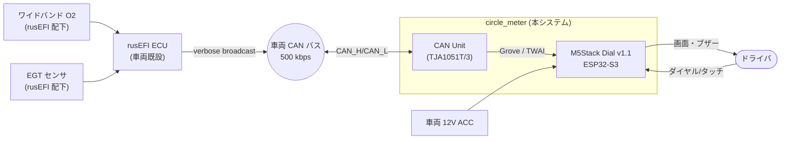

# 11. システム要求仕様書 (SYS.2)

| 項目 | 内容 |
|---|---|
| 文書ID | `DOC-11` |
| プロセス | SYS.2 システム要求分析 / MAN.5 リスク管理 |
| 版 | 0.1 (Draft) |
| 最終更新 | 2026-09-21 |

---

## 1. システム境界

**境界の定義**: 本システムは CAN バス上の 1 ノードとして**受信のみ**を行う。
ワイドバンドコントローラ・EGT アンプ・ECU 設定は本システムのスコープ外であり、
それらが rusEFI の `Lambda1` / `EGT1` センサとして正しく構成済みであることを前提とする。

## 2. システム要求

### 2.1 機能要求 — データ取得

| ID | 要求 | 上位 | 検証 |
|---|---|---|---|
| `SYS-01` | CAN 2.0A/2.0B、ビットレート **500 kbps**（既定）でバスに接続し、フレームを受信すること。ビットレートは 250/500/1000 kbps から設定変更できること | CST-03 | `IT-01` |
| `SYS-02` | rusEFI verbose broadcast のベース ID（既定 `0x200`）から相対オフセットでフレームを識別すること。ベース ID は設定で変更できること | CST-03 | `UT-01` |
| `SYS-03` | `BASE+7` (`0x207`) から **Lambda1**（分解能 0.0001 λ/LSB、リトルエンディアン、byte0-1）を取得すること | STK-01 | `UT-02` |
| `SYS-04` | `BASE+9` (`0x209`) から **EGT1**（分解能 5 °C/LSB、byte0）を取得すること | STK-03 | `UT-03` |
| `SYS-05` | `BASE+0,1,3,4` から 状態フラグ・RPM・水温・吸気温・油圧・バッテリ電圧を取得すること（副表示ページ用） | STK-06 | `UT-04` |
| `SYS-06` | 受信バッファは 32 フレーム以上のキューを持ち、UI 処理の遅延によってフレームを取りこぼさないこと | SYS-12 | `IT-03` |
| `SYS-07` | **CAN バスへフレームを送信しないこと**。TWAI は受信専用モード（Listen Only を既定）で動作すること | STK-13, CST-04 | `IT-04` |

### 2.2 機能要求 — 表示

| ID | 要求 | 上位 | 検証 |
|---|---|---|---|
| `SYS-10` | 円形ディスプレイ (240×240) の**外周部にリング状バーグラフ**を描画し、λ 値に比例して伸縮させること | STK-02 | `QT-02` |
| `SYS-11` | バーグラフの色は λ 値に応じて 5 段階（過濃/濃/適正/リーン/過リーン）に変化すること。境界値は設定変更できること | STK-02 | `UT-05`, `QT-02` |
| `SYS-12` | 画面の更新レートは **30 fps 以上**を維持すること（λ ページ、値が毎フレーム変化する条件下で計測） | STK-05 | `QT-03` |
| `SYS-13` | CAN フレーム受信から画面反映までの遅延（glass-to-glass）を **120 ms 以下**とすること | STK-05 | `QT-04` |
| `SYS-14` | 内周に λ の数値を表示し、**AFR 表示 / λ 表示**を切り替えられること。AFR は `AFR = λ × 理論空燃比` で算出し、理論空燃比（既定 14.7）は設定変更できること | STK-04 | `UT-06` |
| `SYS-15` | 内周下部に排気温度を **°C 整数**で表示すること | STK-04 | `QT-02` |
| `SYS-16` | 排気温度が警告閾値（既定 850 °C）を超えたとき数値を黄、危険閾値（既定 920 °C）を超えたとき赤で表示し、画面全体に視認できる警告表現を出すこと | STK-03 | `UT-07`, `QT-05` |
| `SYS-17` | λ バーグラフの表示レンジは既定 **λ 0.68 – 1.36**（ガソリン AFR 10.0 – 20.0 相当）とし、設定変更できること | STK-02 | `UT-05` |
| `SYS-18` | 電源投入時にオープニング画面を表示すること。表示時間は 1.5 秒を上限とし、その間も CAN 受信は開始していること | STK-08 | `QT-06` |
| `SYS-19` | 電源投入から最初の描画までを **1.0 秒以内**とすること | STK-08 | `QT-06` |
| `SYS-20` | 画面輝度を 5 段階以上で調整でき、設定は不揮発に保持されること | STK-11, STK-14 | `IT-05` |

### 2.3 機能要求 — 操作

| ID | 要求 | 上位 | 検証 |
|---|---|---|---|
| `SYS-30` | ロータリーエンコーダの回転で**ページを切り替え**られること。1 ディテント = 1 ページ送り | STK-07 | `IT-06` |
| `SYS-31` | エンコーダ中央のボタン短押しで、そのページの副機能（例: AFR/λ 切替）を実行できること | STK-04 | `IT-06` |
| `SYS-32` | ボタン長押し（1.5 秒以上）で設定メニューに入れること | STK-14 | `IT-06` |
| `SYS-33` | タッチ操作は補助入力とし、タッチのみで到達できる機能を作らないこと（走行中の操作性と誤タッチ防止のため） | STK-07 | `QT-07` |
| `SYS-34` | 操作入力から画面反応までを **100 ms 以下**とすること | STK-07 | `QT-04` |
| `SYS-35` | 最後に表示していたページを不揮発に保持し、次回起動時に復帰すること | STK-14 | `IT-05` |

### 2.4 診断・異常時要求（安全に直結）

| ID | 要求 | 上位 | 検証 |
|---|---|---|---|
| `SYS-40` | 各信号について最終受信時刻を保持し、**500 ms** 以上更新がない場合は「鮮度切れ」として数値をグレー表示に切り替えること | STK-10 | `UT-08`, `IT-02` |
| `SYS-41` | **2000 ms** 以上更新がない場合は数値を `--` とし、「NO SIGNAL」を明示すること。**直前の値を保持して表示し続けてはならない** | STK-10 | `UT-08`, `IT-02` |
| `SYS-42` | λ = 0（センサ未ウォームアップ / rusEFI が値を持たない状態）を有効値として表示せず、`--` とすること | STK-10 | `UT-09` |
| `SYS-43` | TWAI コントローラがバスオフに遷移した場合、自動的に復旧処理を行い、復旧中は画面に「CAN ERROR」を表示すること | STK-10 | `IT-07` |
| `SYS-44` | ウォッチドッグを有効にし、UI タスクが 3 秒以上応答しない場合にリセットすること | — | `IT-08` |
| `SYS-45` | 起動後 5 秒以内に 1 フレームも受信できない場合、「WAITING FOR ECU」を表示すること（正常な起動順序でも発生しうるため、エラーとは区別する） | STK-10 | `IT-02` |

### 2.5 電気的・機械的要求

| ID | 要求 | 上位 | 検証 |
|---|---|---|---|
| `SYS-50` | 電源電圧 **DC 9 – 16 V** の範囲で正常動作すること（M5Dial の入力仕様 6–36 V の内側で規定） | CST-05 | `IT-09` |
| `SYS-51` | クランキング時の電圧降下（6 V まで、1 秒以内）で再起動しても、復帰後 2 秒以内に通常表示へ戻ること | CST-05 | `IT-09` |
| `SYS-52` | 車両 CAN バスへの接続は**終端抵抗を追加しない**こと。CAN Unit 上に終端抵抗が実装されている場合は除去または無効化すること | RSK-02 | `IT-10` |
| `SYS-53` | 筐体は M5Dial 標準の 51 × 51 × 32.3 mm を超えないこと。取り付けは既存のメーターポッド / ステー経由とする | STK-12 | — |
| `SYS-54` | ファームウェア書き込みは USB Type-C 経由で行えること。車両からの取り外しを要してもよい | STK-15 | `IT-11` |

### 2.6 保守性要求

| ID | 要求 | 上位 | 検証 |
|---|---|---|---|
| `SYS-60` | 表示ページの追加が、既存ページのコードを変更せずに行える構造であること | STK-16 | レビュー |
| `SYS-61` | 実車に接続せずに開発できるよう、CAN フレームを模擬入力できる手段（ビルドフラグまたはシミュレータ）を備えること | CST-07 | `IT-12` |
| `SYS-62` | 診断ページを備え、CAN 受信フレームレート・エラーカウンタ・FPS・空きヒープを表示すること | SH-3 | `IT-13` |

## 3. リスク・ハザード分析 (MAN.5)

「表示器が誤った情報を与えることによりドライバが誤った判断をする」を最上位ハザードとして扱う。

| ID | リスク | 影響 | 発生度 | 対策 | 対応要求 |
|---|---|---|---|---|---|
| `RSK-01` | CAN 途絶後に**最後の値が表示され続け**、ドライバが正常と誤認する | **高**（リーン状態を見落としエンジン損傷） | 中 | 鮮度管理を必須化。タイムアウトで値を消す | `SYS-40`, `SYS-41` |
| `RSK-02` | CAN Unit の終端抵抗により、バス上に**終端が 3 本**になり通信品質が劣化する | 高（ECU 側通信にも影響） | **高** | 接続前に CAN Unit 基板の終端抵抗有無を実測確認。バス抵抗値が 60 Ω 付近であることを確認 | `SYS-52`, `IT-10` |
| `RSK-03` | 車室内高温（夏季 60 °C 超）が M5Dial の動作保証範囲 0–40 °C を超える | 中（表示異常・寿命低下） | **高** | 直射日光を避ける設置、通気確保。高温時の挙動を記録し、必要なら能動対策を追加 | `CST-06` / 未解決 |
| `RSK-04` | Grove コネクタの振動による接触不良 | 中（表示途絶） | 中 | コネクタをタイラップで固定。`SYS-43` の復旧処理で自動回復 | `SYS-43` |
| `RSK-05` | λ 値の色分け閾値がエンジン仕様と合わず、誤った安心感を与える | 中 | 中 | 閾値を設定可能にし、既定値の根拠を `DOC-23` に明記 | `SYS-11` |
| `RSK-06` | 誤ってバスへフレームを送出し、ECU の CAN 処理に影響する | **高** | 低 | TWAI を Listen Only モードで初期化。送信 API を実装しない | `SYS-07`, `IT-04` |
| `RSK-07` | 走行中のタッチ誤操作で表示が意図せず切り替わる | 低 | 中 | タッチを補助入力に限定 | `SYS-33` |
| `RSK-08` | rusEFI の CAN 仕様変更でデコードがずれる | 中 | 低 | ICD (`DOC-13`) に参照コミットを固定記録。診断ページで生フレームを確認可能にする | `SYS-62` |
| `RSK-09` | EGT 値が rusEFI 側で未構成の場合、常に 0 °C が送られ「冷えている」と誤読する | 中 | 中 | 0 °C を無効値として扱い `--` 表示とする | `SYS-42` 相当（EGT にも適用） |

## 4. 未解決事項 (Open Issues)

| ID | 内容 | 期限 |
|---|---|---|
| `OPN-01` | 所有する CAN Unit の型番確定（Unit CAN `U085` / Mini CAN `U179`）と終端抵抗の有無 | 実装フェーズ前 |
| `OPN-02` | M5Dial PORT.B の GPIO 割当（G1/G2）と Grove 線色の対応（黄/白どちらが G1 か）を実測確認 | ブリングアップ時 |
| `OPN-03` | 車両 rusEFI 側で `Lambda1` / `EGT1` が構成済みか、`canSleepPeriodMs` の実設定値 | 実装フェーズ前 |
| `OPN-04` | 高温環境対策（`RSK-03`）の具体策 | v1.0 リリース前 |
| `OPN-05` | オープニング画面用ロゴ素材の入手・フォーマット | HMI 実装前 |
