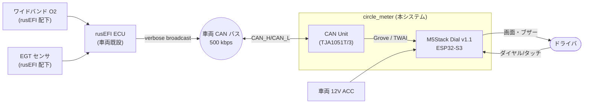

# 11. システム要求仕様書 (SYS.2)

| 項目 | 内容 |
|---|---|
| 文書ID | `DOC-11` |
| プロセス | SYS.2 システム要求分析 / MAN.5 リスク管理 |
| 版 | 0.1 (Draft) |
| 最終更新 | 2026-10-04 |

---

## 1. システム境界

```mermaid
flowchart LR
    ECU["rusEFI ECU\n(車両既設)"]
    WB["ワイドバンド O2\n(rusEFI 配下)"]
    EGTS["EGT センサ\n(rusEFI 配下)"]
    BUS(("車両 CAN バス\n500 kbps"))
    subgraph SUT["circle_meter (本システム)"]
      CANU["CAN Unit\n(TJA1051T/3)"]
      DIAL["M5Stack Dial v1.1\nESP32-S3"]
    end
    DRV(["ドライバ"])
    PWR["車両 12V ACC"]

    WB --> ECU
    EGTS --> ECU
    ECU -->|verbose broadcast| BUS
    BUS <-->|CAN_H/CAN_L| CANU
    CANU -->|Grove / TWAI| DIAL
    PWR --> DIAL
    DIAL -->|画面・ブザー| DRV
    DRV -->|ダイヤル/タッチ| DIAL
```

**境界の定義**: 本システムは CAN バス上の 1 ノードとして**受信のみ**を行う。
ワイドバンドコントローラ・EGT アンプ・ECU 設定は本システムのスコープ外であり、
それらが rusEFI の `Lambda1` / `EGT1` センサとして正しく構成済みであることを前提とする。

## 2. システム要求

### 2.1 機能要求 — データ取得

| ID | 要求 | 上位 | 検証 |
|---|---|---|---|
| `SYS-01` | CAN 2.0A/2.0B、ビットレート **500 kbps**（既定）でバスに接続し、フレームを受信すること。ビットレートは 250/500/1000 kbps から設定変更できること | CST-03 | `IT-01` |
| `SYS-02` | rusEFI verbose broadcast のベース ID（既定 `0x200`）から相対オフセットでフレームを識別すること。ベース ID は設定で変更できること | CST-03 | `UT-01` |
| `SYS-03` | `BASE+7` (`0x207`) から **Lambda1**（分解能 0.0001 λ/LSB、リトルエンディアン、byte0-1）を取得すること | STK-01 | `UT-02` |
| `SYS-04` | `BASE+9` (`0x209`) から **EGT1**（分解能 5 °C/LSB、byte0）を取得すること | STK-03 | `UT-03` |
| `SYS-05` | `BASE+0,1,3,4` から 状態フラグ・RPM・水温・吸気温・油圧・バッテリ電圧を取得すること（副表示ページ用） | STK-06 | `UT-04` |
| `SYS-06` | 受信バッファは 32 フレーム以上のキューを持ち、UI 処理の遅延によってフレームを取りこぼさないこと | SYS-12 | `IT-03` |
| `SYS-07` | **CAN バスへフレームを送出しないこと**（データフレーム・リモートフレームのいずれも）。ただし CAN プロトコルが要求する **ACK は返すこと**。ACK を返さないと送信側が再送を繰り返し、最終的にバスオフに陥るため（`RSK-10`） | STK-13, CST-04 | `IT-04` |

### 2.2 機能要求 — 表示

| ID | 要求 | 上位 | 検証 |
|---|---|---|---|
| `SYS-10` | 円形ディスプレイ (**480×480**) の**外周部にリング状バーグラフ**を描画し、λ 値に比例して伸縮させること | STK-02 | `QT-02` |
| `SYS-11` | バーグラフの色は λ 値に応じて 5 段階（過濃/濃/適正/リーン/過リーン）に変化すること。境界値は設定変更できること | STK-02 | `UT-05`, `QT-02` |
| `SYS-12` | 画面の更新レートは **30 fps 以上**を維持すること（λ ページ、値が毎フレーム変化する条件下で計測） | STK-05 | `QT-03` |
| `SYS-13` | CAN フレーム受信から画面反映までの遅延（glass-to-glass）を **120 ms 以下**とすること | STK-05 | `QT-04` |
| `SYS-14` | 内周に λ の数値を表示し、**AFR 表示 / λ 表示**を切り替えられること。AFR は `AFR = λ × 理論空燃比` で算出し、理論空燃比（既定 14.7）は設定変更できること | STK-04 | `UT-06` |
| `SYS-15` | 内周下部に排気温度を **°C 整数**で表示すること | STK-04 | `QT-02` |
| `SYS-16` | 排気温度が警告閾値（既定 850 °C）を超えたとき数値を黄、危険閾値（既定 920 °C）を超えたとき赤で表示し、画面全体に視認できる警告表現を出すこと | STK-03 | `UT-07`, `QT-05` |
| `SYS-17` | λ バーグラフの表示レンジは既定 **λ 0.68 – 1.36**（ガソリン AFR 10.0 – 20.0 相当）とし、設定変更できること | STK-02 | `UT-05` |
| `SYS-18` | 電源投入時にオープニング画面を表示すること。表示時間は **3.0 秒**を上限とし、その間も CAN 受信は開始していること | STK-08 | `QT-06` |
| `SYS-19` | 電源投入から最初の描画までを **2.0 秒以内**とすること。**改訂（2026-10-02）**: 当初 1.0 秒。LCD-2.1 では表示の初期化（ST7701 の初期化列・IO エキスパンダ・タッチ。`Board::begin()`）だけで約 1.1 秒かかり、実力は約 1.6 秒だった。運用上（ACC オンから走り出すまで）問題ないとして実力値に余裕を足した値に改めた | STK-08 | `QT-06` |
| `SYS-20` | 画面輝度を 5 段階以上で調整でき、設定は不揮発に保持されること。**バックライトは LEDC PWM（GPIO6）で制御する** | STK-11, STK-14 | `IT-05` |
| `SYS-21` | λ ページの**表示デザインを複数持ち、設定で切り替えられる**こと。少なくとも (a) 外周リングのバーグラフ（AEM 風）と (b) 針で指す指針式（大森風、`DOC-23 §3.5`）の 2 種を持つ。どのデザインでも `SYS-11`（5 段階の色）・`SYS-12`（30 fps）・`SYS-14`〜`SYS-16`・信号喪失時の扱い（`RSK-01`）を満たすこと。**追加（2026-10-04）**: 車両の純正メーター（黒盤・白文字・針）と揃えたいという要望による | STK-01, STK-02 | `QT-02`, `QT-03` |

### 2.3 機能要求 — 操作

| ID | 要求 | 上位 | 検証 |
|---|---|---|---|
| `SYS-30` | **左右のスワイプでページを切り替え**られること。1 スワイプ = 1 ページ送り | STK-07 | `IT-06` |
| `SYS-31` | **タップ（短押し）**で、そのページの副機能（例: AFR/λ 切替）を実行できること | STK-04 | `IT-06` |
| `SYS-32` | **長押し（1.5 秒以上）**で設定メニューに入れること | STK-14 | `IT-06` |
| ~~`SYS-33`~~ | ~~タッチ操作は補助入力とし、タッチのみで到達できる機能を作らないこと~~ **（廃止: v0.2 / 2026-09-28）** ハードウェア変更によりロータリーエンコーダが無くなり、タッチが唯一の入力手段になったため前提が逆転した。代替として `SYS-36` を置く | STK-07 | — |
| `SYS-36` | **すべての機能にタッチのみで到達できること**（ページ遷移・全設定変更） | STK-07 | `QT-07` |
| `SYS-34` | 操作入力から画面反応までを **100 ms 以下**とすること | STK-07 | `QT-04` |
| `SYS-35` | 最後に表示していたページを不揮発に保持し、次回起動時に復帰すること | STK-14 | `IT-05` |

### 2.4 診断・異常時要求（安全に直結）

| ID | 要求 | 上位 | 検証 |
|---|---|---|---|
| `SYS-40` | 各信号について最終受信時刻を保持し、**500 ms** 以上更新がない場合は「鮮度切れ」として数値をグレー表示に切り替えること | STK-10 | `UT-08`, `IT-02` |
| `SYS-41` | **2000 ms** 以上更新がない場合は数値を `--` とし、「NO SIGNAL」を明示すること。**直前の値を保持して表示し続けてはならない** | STK-10 | `UT-08`, `IT-02` |
| `SYS-42` | λ = 0（センサ未ウォームアップ / rusEFI が値を持たない状態）を有効値として表示せず、`--` とすること | STK-10 | `UT-09` |
| `SYS-43` | TWAI コントローラがバスオフに遷移した場合、自動的に復旧処理を行い、復旧中は画面に「CAN ERROR」を表示すること | STK-10 | `IT-07` |
| `SYS-44` | ウォッチドッグを有効にし、UI タスクが 3 秒以上応答しない場合にリセットすること | — | `IT-08` |
| `SYS-45` | 起動後 5 秒以内に 1 フレームも受信できない場合、「WAITING FOR ECU」を表示すること（正常な起動順序でも発生しうるため、エラーとは区別する） | STK-10 | `IT-02` |

### 2.5 電気的・機械的要求

| ID | 要求 | 上位 | 検証 |
|---|---|---|---|
| `SYS-50` | 電源電圧 **DC 9 – 16 V** の範囲で正常動作すること（CAN Unit の端子台入力 9–24 V の内側で規定。**下限 9 V は CAN Unit の下限と一致し余裕が無い**ため `IT-09` で実測確認する） | CST-05 | `IT-09` |
| `SYS-51` | クランキング時の電圧降下（6 V まで、1 秒以内）で再起動しても、復帰後 2 秒以内に通常表示へ戻ること | CST-05 | `IT-09` |
| `SYS-52` | 車両 CAN バスへの接続は**終端抵抗を追加しない**こと。CAN Unit 上に終端抵抗が実装されている場合は除去または無効化すること | RSK-02 | `IT-10` |
| `SYS-53` | 筐体はダッシュボード上のメーターポッド / ステーに収まる丸形であること。具体寸法は `OPN-10` で確定する | STK-12 | — |
| `SYS-54` | ファームウェア書き込みは USB Type-C 経由で行えること。車両からの取り外しを要してもよい | STK-15 | `IT-11` |

### 2.6 保守性要求

| ID | 要求 | 上位 | 検証 |
|---|---|---|---|
| `SYS-60` | 表示ページの追加が、既存ページのコードを変更せずに行える構造であること | STK-16 | レビュー |
| `SYS-61` | 実車に接続せずに開発できるよう、CAN フレームを模擬入力できる手段（ビルドフラグまたはシミュレータ）を備えること | CST-07 | `IT-12` |
| `SYS-62` | 診断ページを備え、CAN 受信フレームレート・エラーカウンタ・FPS・空きヒープを表示すること | SH-3 | `IT-13` |

## 3. リスク・ハザード分析 (MAN.5)

「表示器が誤った情報を与えることによりドライバが誤った判断をする」を最上位ハザードとして扱う。

| ID | リスク | 影響 | 発生度 | 対策 | 対応要求 |
|---|---|---|---|---|---|
| `RSK-01` | CAN 途絶後に**最後の値が表示され続け**、ドライバが正常と誤認する | **高**（リーン状態を見落としエンジン損傷） | 中 | 鮮度管理を必須化。タイムアウトで値を消す | `SYS-40`, `SYS-41` |
| `RSK-02` | CAN Unit の終端抵抗により、バス上に**終端が 3 本**になり通信品質が劣化する | 高（ECU 側通信にも影響） | **高** | 接続前に CAN Unit 基板の終端抵抗有無を実測確認。バス抵抗値が 60 Ω 付近であることを確認 | `SYS-52`, `IT-10` |
| `RSK-03` | 車室内高温（夏季 60 °C 超）がボードの動作保証範囲を超える。液晶は高温で表示が黒くつぶれる／寿命が縮む | 中（表示異常・寿命低下） | **高** | 直射日光を避ける設置、通気確保。高温時の挙動を記録し、必要なら能動対策を追加 | `CST-06` / `OPN-09` |
| `RSK-04` | Grove コネクタの振動による接触不良 | 中（表示途絶） | 中 | コネクタをタイラップで固定。`SYS-43` の復旧処理で自動回復 | `SYS-43` |
| `RSK-05` | λ 値の色分け閾値がエンジン仕様と合わず、誤った安心感を与える | 中 | 中 | 閾値を設定可能にし、既定値の根拠を `DOC-23` に明記 | `SYS-11` |
| `RSK-06` | 誤ってバスへフレームを送出し、ECU の CAN 処理に影響する | **高** | 低 | 3 層で防ぐ: ① 送信 API を実装しない ② 送信キュー長を 0 にして物理的にキューイングできなくする ③ CI の静的チェックで `twai_transmit` の混入を検出する | `SYS-07`, `IT-04` |
| `RSK-07` | 走行中のタッチ誤操作で表示が意図せず切り替わる | **低** | 中 | **受容する**（2026-09-28 判断）。サーキット走行が主用途で走行中に UI を触らない運用であること、誤って切り替わってもスワイプで戻せること、λ・EGT の表示そのものは失われないことから、影響度は低いと判断した。車速・回転数によるロック機構は実装しない | — |
| `RSK-08` | rusEFI の CAN 仕様変更でデコードがずれる | 中 | 低 | ICD (`DOC-13`) に参照コミットを固定記録。診断ページで生フレームを確認可能にする | `SYS-62` |
| `RSK-09` | EGT 値が rusEFI 側で未構成の場合、常に 0 °C が送られ「冷えている」と誤読する | 中 | 中 | 0 °C を無効値として扱い `--` 表示とする | `SYS-42` 相当（EGT にも適用） |
| `RSK-11` | 車両のロードダンプ等の過渡電圧が、CAN Unit の定格 9–24 V を超えて DC-DC を破壊する | 高（メータと CAN Unit が同時に死ぬ） | 中 | 入力に TVS ダイオードを追加する。実装可否を `OPN-11` で判断する | `CST-05` |
| `RSK-12` | 12PIN の `VBus` へ外部から給電する構成が電気的に成立するか未検証（USB の VBUS ラインへの外部給電。逆流防止の有無、UART / USB 側への回り込み） | 中 | 中 | 回路図と実機で確認する。成立しない場合は USB-C 経由の給電に切り替える | `OPN-14` |
| `RSK-13` | CAN に USB の D−/D+（GPIO19/20）を使うため、(a) ネイティブ USB-C にケーブルを挿すと CAN と信号が競合する (b) 起動直後の USB PHY の挙動がバスに影響する可能性 | 中 | 中 | (a) 運用で避け `DOC-12 §3.1` に明記する (b) `IT-04` で起動時にバスへフレームが出ないことを確認する | `OPN-13`, `IT-04` |
| `RSK-14` | RGB パネルのフレームバッファが PSRAM にあり、パネル DMA が常時読み出すため、CPU の PSRAM アクセスや Flash 書き込み（NVS）で表示が乱れる | 中（値の誤りではなく表示の乱れ） | **高** | bounce buffer を使う。NVS への書き込みは設定変更時のみに限る。`OPN-12` で実測する | `OPN-12`, `DEC-05` |
| `RSK-10` | **本機が ACK を返さないことで rusEFI が送信を完了できず、再送を繰り返してバスオフに陥る** | **高**（ECU の CAN が停止する。`RSK-06` を避けるつもりの対策が逆に ECU を壊す） | **高**（バス上が rusEFI と本機の 2 ノードだけなら必ず発生。NA ロードスターは純正 CAN を持たないためこの構成になりやすい） | TWAI を NORMAL モードで初期化し、受信したフレームに ACK を返す。ACK はプロトコル上必須の参加であり「書き込み」ではない | `SYS-07`, `IT-04`, `IT-15` |

## 4. 未解決事項 (Open Issues)

| ID | 内容 | 期限 |
|---|---|---|
| `OPN-01` | 所有する CAN Unit の型番確定（Unit CAN `U085` / Mini CAN `U179`）と終端抵抗の有無 | 実装フェーズ前 |
| `OPN-03` | 車両 rusEFI 側で `Lambda1` / `EGT1` が構成済みか、`canSleepPeriodMs` の実設定値 | 実装フェーズ前 |
| `OPN-04` | 高温環境対策（`RSK-03`）の具体策 | v1.0 リリース前 |
| `OPN-13` | **CAN の TX/RX を GPIO20 / GPIO19（12PIN の D+ / D−）に割り当てる案の実機検証**。起動直後にバスへ何も出ないこと（`IT-04`）、PCAN と通信できること（`IT-15`）を確認する。オンボードブザーの接続先ピンの確認もここで行う | 実装フェーズ前 |
| `OPN-09` | ボードの動作保証温度範囲（`RSK-03` / `CST-06`） | v1.0 リリース前 |
| `OPN-10` | ボードの外形寸法とメーターポッドへの収まり（`SYS-53`） | v1.0 リリース前 |
| `OPN-11` | ロードダンプ対策（`RSK-11`）として TVS を入れるか | v1.0 リリース前 |
| `OPN-12` | **480×480 RGB パネルでの実描画性能と表示の安定性**。(1) 全画面・部分描画の fps、(2) NVS 書き込み中の画面の乱れ、(3) CAN 受信中の安定性を実測し、`SYS-12`（30 fps）を満たせるか確認する。**2026-10-02 の実測**: 素の描画で全面更新 16 fps（不足）/ 480×120 の帯 65 fps / NVS 書き込み中の乱れなし。LVGL 9.2.2 の λ ページ（値が毎フレーム動く条件）は、変化した桁・角度だけを無効化する設計（`DEC-08`）により **40 Hz 更新で平均 39 fps / 最小 35 fps**（`SYS-12` 達成。`test_records/2026-10-02_lcd21_lvgl.md`）。**残り: CAN 受信中の安定性、LVGL 構成での NVS 書き込み中の乱れ（`IT-16`）、λ ページ以外（Dual / Diag / 設定メニュー）の fps** | **実装フェーズ前（最優先）** |
| `OPN-14` | **12PIN の `VBus` へ Mini CAN の 5V を入れて成立するか、および本体の消費電流**。逆流防止の有無、UART / USB 側 VBUS への回り込みを回路図と実機で確認する | 実装フェーズ前 |
| `OPN-15` | **ビルドプラットフォームと表示ライブラリの選定**。**2026-10-02 に暫定決定**（`DEC-01` / `DEC-09`）: pioarduino 55.03.312-1（Arduino-ESP32 3.3.12 / IDF 5.5.5）+ `ESP32_Display_Panel` v1.0.4 + LVGL 9.2.2。RGB パネルの表示・タッチ・バックライト・NVS が動作し、TWAI のレガシードライバ（`driver/twai.h`）も IDF 5.5.5 でビルド・リンクできる。**第三者製プラットフォーム**のため、**残り: (1) TWAI の実機での動作（`OPN-13`）、(2) サプライチェーンの確認（配布元・ハッシュの固定）、(3) CI で `lcd21` をビルドして再現性を確認**。Git Bash では `idf_tools.py` が失敗するので PowerShell から実行する | 実装フェーズ前 |
| `OPN-05` | オープニング画面用ロゴ素材の入手・フォーマット | HMI 実装前 |

## 5. 解決済み事項

| ID | 内容 | 結論 | 日付 |
|---|---|---|---|
| `OPN-06` | M5Dial に PSRAM は搭載されているか | **搭載されていない**。SoC は ESP32-S3FN8（8 MB Flash / PSRAM なし）。通販ページの「8 MB PSRAM」表記は誤り。詳細と設計への影響は `DOC-12 §7.1` | 2026-09-21 |
| `OPN-07` | ESP32-S3 の TWAI を Grove ポートの GPIO に割り当てられるか | **可能**。GPIO マトリクス経由で任意の GPIO に割り当てられる | 2026-09-21 |
| `OPN-02` | **（M5Dial）** CAN Unit をどのポートに繋ぎ、TX/RX はどの GPIO か | **PORT.A に接続。`TX = G13` / `RX = G15`**。PCAN から送出したフレームの受信を実機で確認。PORT.B (G1/G2) 設定のままでは `rx=0` かつ `rec=0`（RX ピンに信号が来ない状態）になる | 2026-09-21 |
| `OPN-08` | Listen Only モードで 2 ノード構成のバスが成立するか | **成立しない**。ACK を返さないため送信側が再送を繰り返す。実測で受信レートが 120 f/s の想定に対し 3650 f/s に達し、先頭フレームが再送に張り付いて後続フレームがバスに出られなくなった。`RSK-10` として登録し、NORMAL モードへ変更（`DEC-04`） | 2026-09-21 |
| `OPN-16` | 本ボード（Waveshare ESP32-S3-Touch-LCD-2.1）の PSRAM と Flash の実体 | **8 MB Octal PSRAM（esptool: `Embedded PSRAM 8MB (AP_3v3)`）/ 16 MB Flash（quad、XMC）**。ESP32-S3 (QFN56) rev v0.2。**実機の応答で確認**。Wiki の記載とも一致した。M5Dial では通販サイトの表記が誤っていた（`OPN-06`）ので、今回は仕様書を信用せず実機で確かめた | 2026-10-01 |
| `OPN-17` | 本ボードの表示バスは何か | **RGB 16 bit 並列**（ST7701S）。Espressif `ESP32_Display_Panel` の公式ボード定義で確認。フレームバッファは PSRAM 必須になる（`DEC-05`）。実機での描画性能は `OPN-12` | 2026-10-01 |
