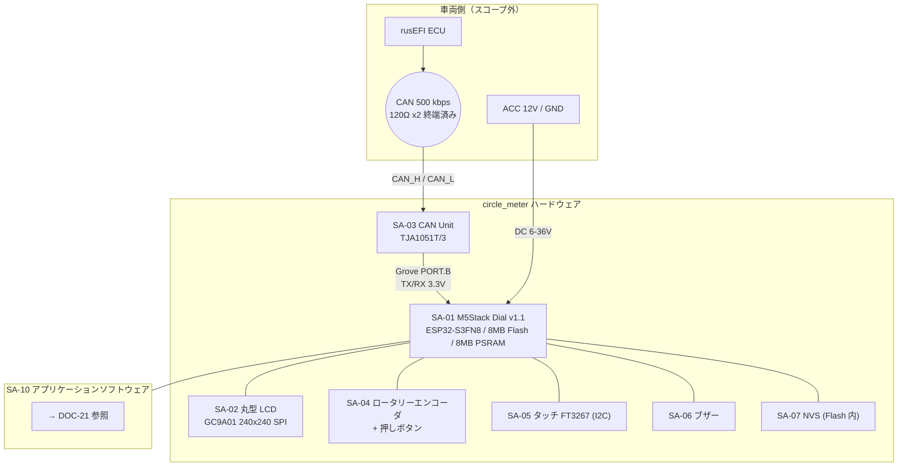
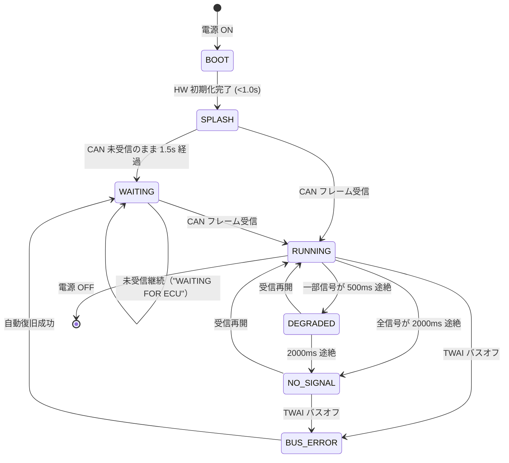

# 12. システムアーキテクチャ設計書 (SYS.3)

| 項目 | 内容 |
|---|---|
| 文書ID | `DOC-12` |
| プロセス | SYS.3 システムアーキテクチャ設計 |
| 版 | 0.1 (Draft) |
| 最終更新 | 2026-09-21 |

---

## 1. アーキテクチャ概要

## 2. ハードウェア要素

| ID | 要素 | 型番 / 仕様 | 根拠要求 |
|---|---|---|---|
| `SA-01` | メイン基板 | M5Stack Dial v1.1 (M5StampS3A / ESP32-S3FN8, 240 MHz dual core, 512 KB SRAM, 8 MB PSRAM, 8 MB Flash) | `CST-01` |
| `SA-02` | 表示器 | 1.28" 丸型 TFT, GC9A01, 240×240, SPI | `SYS-10` |
| `SA-03` | CAN トランシーバ | M5Stack CAN Unit (TJA1051T/3), Grove HY2.0-4P | `CST-02`, `SYS-01` |
| `SA-04` | 入力（主） | ロータリーエンコーダ 16 ディテント / 64 パルス回転 + 押しボタン | `SYS-30` |
| `SA-05` | 入力（補助） | 静電容量タッチ FT3267 (I2C) | `SYS-33` |
| `SA-06` | 聴覚通知 | 80 dB ブザー (GPIO3) | `SYS-16` |
| `SA-07` | 不揮発記憶 | ESP32 NVS パーティション | `SYS-20`, `SYS-35` |
| `SA-08` | 電源 | 車両 ACC 12V → M5Dial 内蔵 DC-DC（入力 6–36 V） | `SYS-50`, `STK-09` |
| `SA-10` | ソフトウェア | 本プロジェクトのファームウェア | `DOC-21` |

## 3. GPIO 割当（M5Dial v1.1）

| 機能 | GPIO | 備考 |
|---|---|---|
| LCD RS (DC) | G4 | GC9A01 |
| LCD MOSI | G5 | |
| LCD SCK | G6 | SPI クロック 80 MHz を目標 |
| LCD CS | G7 | |
| LCD RESET | G8 | RFID RST と共用（M5Unified が調停） |
| LCD BL (バックライト) | G9 | PWM 輝度制御 `SYS-20` |
| Touch SCL / SDA / INT | G11 / G12 / G14 | FT3267。RTC(BM8563) と I2C バス共用 |
| Encoder A / B | G41 / G40 | |
| Button (エンコーダ押下) | G42 | ※ブリングアップで要確認 `OPN-02` |
| Buzzer | G3 | |
| Power HOLD | G46 | 電源保持 |
| **PORT.A (I2C)** | G13 / G15 | 本プロジェクトでは未使用（将来の外部センサ用に確保） |
| **PORT.B (GPIO)** | G1 / G2 | **CAN TX/RX に割当** |

### 3.1 CAN 配線設計

ESP32-S3 の TWAI コントローラは GPIO マトリクス経由で任意の GPIO に割り当て可能であるため、
CAN Unit が本来想定する PORT.C ではなく、M5Dial が持つ **PORT.B (G1/G2)** を使用する。

| Grove 線色 | CAN Unit 側 | M5Dial PORT.B | ファームウェア設定 |
|---|---|---|---|
| 黒 | GND | GND | — |
| 赤 | 5V | 5V | CAN Unit へ給電 |
| 黄 | CAN_TX | G2（暫定） | `CONFIG_TWAI_TX_GPIO` |
| 白 | CAN_RX | G1（暫定） | `CONFIG_TWAI_RX_GPIO` |

> **`OPN-02`**: Grove 線色と GPIO 番号の対応、および TX/RX の向き（CAN Unit の表記が
> MCU 視点か Unit 視点か）はブリングアップ時に実測で確定する。
> ファームウェアは `platformio.ini` のビルドフラグで TX/RX を入れ替えられる構造とし、
> 配線ミス時にハードを触らず検証できるようにする（`IT-01`）。

> **`RSK-02` / `SYS-52`**: 接続前に、車両側 CAN バスの CAN_H–CAN_L 間抵抗が **約 60 Ω**
> であることをテスターで確認する。CAN Unit 側にも終端が入っていると約 40 Ω になる。
> その場合は CAN Unit 基板上の終端抵抗を除去する。

## 4. HW / SW 機能配分

| 機能 | 実現手段 | 配分先 |
|---|---|---|
| CAN 物理層・差動信号 | TJA1051T/3 | HW (`SA-03`) |
| CAN データリンク層（ビットタイミング、ACK、エラー管理） | ESP32-S3 TWAI ペリフェラル | HW (`SA-01`) |
| フレーム ID フィルタ | TWAI アクセプタンスフィルタ（`0x200`–`0x20B` を通す） | HW + SW 設定 |
| 信号デコード・スケーリング | ソフトウェア | SW (`SWA-03`) |
| 鮮度管理・異常判定 | ソフトウェア | SW (`SWA-04`) |
| 描画 | GC9A01 + ESP32-S3 SPI DMA + ソフトウェアレンダリング | HW + SW |
| 輝度制御 | LEDC PWM (G9) | HW + SW |
| 不揮発設定 | NVS | SW |

**設計判断**: フレーム ID フィルタをハードウェアのアクセプタンスフィルタで行うことで、
無関係な車両 CAN トラフィック（ロードスター NA は純正 CAN を持たないが、
将来の他 ECU 追加や rusEFI の OBD-II 応答 `0x7E8` などを想定）による割り込み負荷を削減する。

## 5. 主要な設計判断と根拠

| ID | 判断 | 代替案 | 選定理由 |
|---|---|---|---|
| `DEC-01` | 描画スタックに **M5Unified (M5GFX) + LVGL 9** を採用 | (a) M5GFX 単体で自前描画 (b) LVGL + LovyanGFX 直結 (c) TFT_eSPI | `DOC-21 §2` 参照。ページ管理・入力・設定メニューを LVGL の既製機能で賄いつつ、λ リングは自前描画で性能と意匠を確保 |
| `DEC-02` | λ リングバーは LVGL の `lv_arc` ではなく **自前 Canvas 描画**とする | `lv_arc` を多段に重ねる | 色分け・目盛・アンチエイリアスを 1 パスで描くため。`lv_arc` は色が単一で、5 色グラデ表現に多重化が必要になり負荷と実装が増える |
| `DEC-03` | CAN 受信とレンダリングを **別タスク・別コア**に分離 | 単一ループでポーリング | 描画の一時的な重さが受信取りこぼしを起こさないため (`SYS-06`) |
| `DEC-04` | TWAI を **Listen Only モード**で初期化 | Normal モード | 物理的に送信できない状態を作り、`RSK-06` を設計で潰す |
| `DEC-05` | 描画バッファは **内部 SRAM に 240×120 の部分バッファ ×2** | PSRAM に全画面バッファ | PSRAM は帯域が内部 SRAM より低く、LVGL のフラッシュ時にボトルネックになる。240×120×2byte = 57.6 KB ×2 = 115 KB を内部 SRAM から確保 |
| `DEC-06` | CAN デコード層を **ハードウェア非依存の純粋関数**として分離 | ドライバ内でデコード | PC 上 (`native` 環境) で単体テストを回すため (`SWE.4`) |
| `DEC-07` | 電源は ACC 連動とし、遅延 OFF やスーパーキャパシタを設けない | 常時電源 + ソフト OFF | 設定は NVS に即時保存するため、電源断で失うデータがない (`SYS-35`) |

## 6. システム状態遷移

| 状態 | 画面挙動 | 対応要求 |
|---|---|---|
| `BOOT` | 画面消灯（バックライト OFF でちらつきを隠す） | `SYS-19` |
| `SPLASH` | ロゴ表示。CAN 受信タスクは既に稼働 | `SYS-18` |
| `WAITING` | "WAITING FOR ECU" + 経過秒 | `SYS-45` |
| `RUNNING` | 通常表示 | — |
| `DEGRADED` | 該当信号のみグレー表示 | `SYS-40` |
| `NO_SIGNAL` | 数値を `--`、"NO SIGNAL" バナー | `SYS-41` |
| `BUS_ERROR` | "CAN ERROR" + 復旧カウンタ | `SYS-43` |

## 7. リソース予算

| リソース | 総量 | 予算 | 備考 |
|---|---|---|---|
| 内部 SRAM | 512 KB | LVGL 描画バッファ 115 KB / LVGL ヒープ 48 KB / タスクスタック 24 KB | 空き 150 KB 以上を維持（`SYS-62` で監視） |
| PSRAM | 8 MB | フォント・ロゴ画像のキャッシュ | 描画パスには使わない (`DEC-05`) |
| Flash | 8 MB | アプリ 2 MB × 2 (OTA 予備) + NVS + SPIFFS(ロゴ) | パーティション定義は `DOC-40` |
| CPU Core 0 | — | CAN 受信・デコード・鮮度管理（負荷目標 < 10 %） | |
| CPU Core 1 | — | LVGL + 描画（負荷目標 < 70 % @ 30 fps） | |
