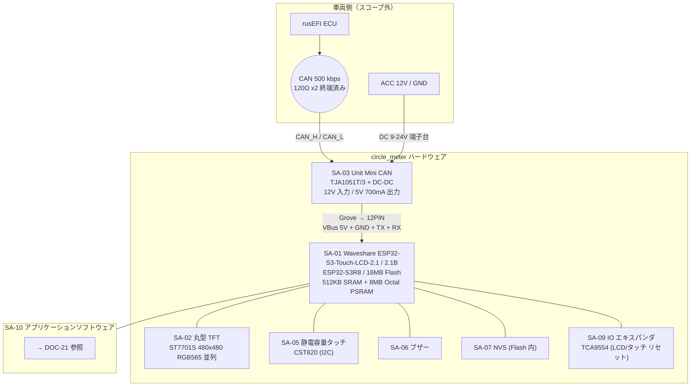
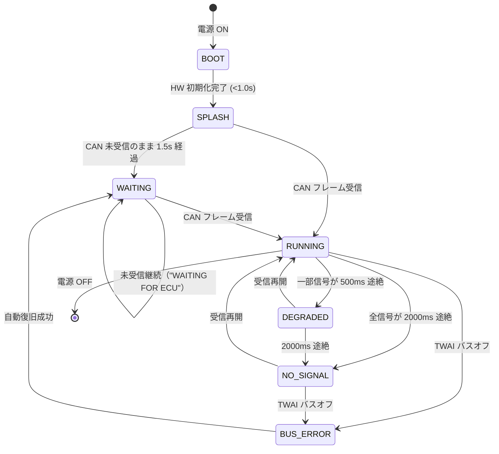

# 12. システムアーキテクチャ設計書 (SYS.3)

| 項目 | 内容 |
|---|---|
| 文書ID | `DOC-12` |
| プロセス | SYS.3 システムアーキテクチャ設計 |
| 版 | 0.1 (Draft) |
| 最終更新 | 2026-10-05 |

---

## 1. アーキテクチャ概要


```mermaid
flowchart TB
    subgraph VEH["車両側（スコープ外）"]
      ECU["rusEFI ECU"]
      BUS(("CAN 500 kbps\n120Ω x2 終端済み"))
      ACC["ACC 12V / GND"]
    end

    subgraph HW["circle_meter ハードウェア"]
      SA3["SA-03 Unit Mini CAN\nTJA1051T/3 + DC-DC\n12V 入力 / 5V 700mA 出力"]
      SA1["SA-01 Waveshare ESP32-S3-Touch-LCD-2.1 / 2.1B\nESP32-S3R8 / 16MB Flash\n512KB SRAM + 8MB Octal PSRAM"]
      SA2["SA-02 丸型 TFT\nST7701S 480x480 RGB565 並列"]
      SA5["SA-05 静電容量タッチ\nCST820 (I2C)"]
      SA6["SA-06 ブザー"]
      SA7["SA-07 NVS (Flash 内)"]
      SA9["SA-09 IO エキスパンダ\nTCA9554 (LCD/タッチ リセット)"]
    end

    subgraph SW["SA-10 アプリケーションソフトウェア"]
      SWX["→ DOC-21 参照"]
    end

    ECU --> BUS
    BUS -->|CAN_H / CAN_L| SA3
    ACC -->|DC 9-24V 端子台| SA3
    SA3 -->|Grove → 12PIN\nVBus 5V + GND + TX + RX| SA1
    SA1 --- SA2
    SA1 --- SA5
    SA1 --- SA6
    SA1 --- SA7
    SA1 --- SA9
    SA1 --- SW
```

## 2. ハードウェア要素

| ID | 要素 | 型番 / 仕様 | 根拠要求 |
|---|---|---|---|
| `SA-01` | メイン基板 | Waveshare **ESP32-S3-Touch-LCD-2.1**（平面タッチ）/ **2.1B**（2.5D 曲面タッチ）。電子部品は同一。ESP32-S3**R8**（QFN56 rev v0.2）、240 MHz dual core、512 KB 内蔵 SRAM + **8 MB Octal PSRAM**、**16 MB Flash（quad）**。**実機の esptool 応答で確認済み（2026-10-01）** | `CST-01` |
| `SA-02` | 表示器 | 2.1" 丸型 TFT、**ST7701S**、**480×480**、**RGB565 16bit 並列**（PCLK 16 MHz）。パネルの初期化は 3 線 SPI で行い、その CS は IO エキスパンダ経由 | `SYS-10` |
| `SA-03` | CAN トランシーバ + 電源 | M5Stack Unit Mini CAN (TJA1051T/3)。端子台 9–24 V 入力、Grove へ **5 V / 最大 700 mA 出力**。トランシーバ自身の消費は 5 V で約 4 mA | `CST-02`, `SYS-01`, `STK-09` |
| ~~`SA-04`~~ | ~~入力（主）~~ | ~~ロータリーエンコーダ~~ **（廃止: v0.2）** 本ボードには搭載されていない | — |
| `SA-05` | 入力 | 静電容量タッチ（**CST820 系**。実機の ChipID `0xB7`）、I2C、INT = GPIO16。**唯一の入力手段** | `SYS-30`–`SYS-32`, `SYS-36` |
| `SA-06` | 聴覚通知 | オンボードのブザー（Wiki に記載あり。接続先ピンは `OPN-13` の一環で確認する） | `SYS-16` |
| `SA-07` | 不揮発記憶 | ESP32 NVS パーティション | `SYS-20`, `SYS-35` |
| `SA-08` | 電源 | 車両 ACC 12V → `SA-03` の DC-DC → 5 V → **12PIN の `VBus`** → 本体（LDO ME6217C33M5G、最大 800 mA で 3.3 V を生成）。MX1.25 2P のバッテリコネクタと充電管理を持つ。**`VBus` から給電して成立するかは実機で確認する**（`OPN-14`） | `SYS-50`, `STK-09` |
| `SA-09` | IO エキスパンダ | TCA9554PWR（I2C `0x20`）。EXIO0 = LCD リセット、EXIO1 = タッチリセット、ほかに LCD 3 線 SPI の CS。全ピン使用済みで外には出ていない | `SYS-10` |
| `SA-10` | ソフトウェア | 本プロジェクトのファームウェア | `DOC-21` |

## 3. GPIO 割当（ESP32-S3-Touch-LCD-2.1）

一次情報:
- Espressif `esp-arduino-libs/ESP32_Display_Panel` の `BOARD_WAVESHARE_ESP32_S3_TOUCH_LCD_2_1.h`
- Waveshare Wiki の「12PIN Wire Interface Pin Mapping Table」

| 機能 | GPIO | 備考 |
|---|---|---|
| RGB HSYNC / VSYNC / DE / PCLK | 38 / 39 / 40 / 41 | |
| RGB データ B0–B4 | 5, 45, 48, 47, 21 | 16 bit 並列の下位（青） |
| RGB データ G0–G5 | 14, 13, 12, 11, 10, 9 | 同（緑） |
| RGB データ R0–R4 | 46, 3, 8, 18, 17 | 同（赤） |
| LCD 3 線 SPI SDA / SCK | 1 / 2 | CS は IO エキスパンダ。パネル初期化専用 |
| バックライト | 6 | **LEDC PWM**（`SWR-47`） |
| I2C SDA / SCL | 15 / 7 | タッチ・RTC・IMU・IO エキスパンダが共用。**CAN には使えない** |
| タッチ INT | 16 | |
| IO エキスパンダ | I2C `0x20` | EXIO0 = LCD RST、EXIO1 = タッチ RST |
| **12PIN: D− / D+** | **19 / 20** | USB 差動、または GPIO |
| 12PIN: TXD / RXD | 43 / 44 | UART0。**UART Type-C 接続中はヘッダ側から切断される**（FSUSB42UMX） |
| 12PIN: IO0 | 0 | BOOT ボタンと共用（ストラッピング） |

### 3.0 空きピンの導出

| 除外理由 | GPIO |
|---|---|
| 存在しない | 22–25 |
| SPI Flash | 26–32 |
| **Octal PSRAM（ESP32-S3R8）** | 33–37 |
| 上表でボードが使用 | 1, 2, 3, 5, 6, 7, 8, 9, 10, 11, 12, 13, 14, 15, 16, 17, 18, 21, 38–41, 45–48 |

残るのは **0 / 4 / 19 / 20 / 42 / 43 / 44** の 7 本。このうち 4 と 42 は外部に出ていない
（TF カードやブザーで使用と推定されるが**未確認**）。**外部に出て使えるのは 0 / 19 / 20 / 43 / 44 の 5 本**で、
Wiki の 12PIN 割当表と一致する。

> LCD の RGB 並列が 20 本、制御系を含めると、ほぼ全ピンが埋まる。
> M5Dial のように「外部ポートに GPIO が余っている」状況ではない。CAN に割ける 2 本を選ぶのに制約の確認が要る。

### 3.1 CAN 配線設計

#### 候補の比較

| 候補 | 判定 | 理由 |
|---|---|---|
| **TX = GPIO20 (D+) / RX = GPIO19 (D−)** | **採用案** | 書き込み・ログは専用の **CH343P UART Type-C** で取れるため、CAN を繋いだまま開発できる。USB の PHY は本機で使わない。**懸念**: 起動直後の USB PHY の挙動、ネイティブ USB-C にケーブルを挿すと競合する（`RSK-13`） |
| GPIO43 / GPIO44 | 不採用 | ROM ブートローダがリセットのたびに **U0TXD (GPIO43) へブートログを出力**する。TXD に接続するとログが CAN バスにノイズとして出る（`SYS-07` / `RSK-06` に反する）。さらに UART 切替スイッチが **UART Type-C 接続中は 12PIN 側を切断**するため、書き込み・ログ取得中は CAN が繋がらず、ベンチ検証ができない |
| GPIO0 | 不採用 | ストラッピングピン。RX に使うと、起動時にバスがドミナントだと**ダウンロードモードに入る**危険がある。TX なら可能だが BOOT ボタンと同一ネットで、押すとバスを乱す |

#### 配線

| Grove（Mini CAN） | 12PIN | ファームウェア設定 |
|---|---|---|
| 黒 GND | GND | — |
| 赤 5V（出力） | **VBus** | — |
| 黄 CAN_TX | **D+ (GPIO20)** | `CM_TWAI_TX_GPIO=20` |
| 白 CAN_RX | **D− (GPIO19)** | `CM_TWAI_RX_GPIO=19` |

ESP32-S3 の TWAI は GPIO マトリクス経由なので、どの GPIO でも割り当てられる
（`SOC_GPIO_VALID_OUTPUT_GPIO_MASK == SOC_GPIO_VALID_GPIO_MASK`、S3 に入力専用ピンは無い）。
入れ替えはビルドフラグの変更だけで済むため、配線を触らずに切り分けられる。

**これは採用案であり、実機で未検証。** M5Dial では PORT.A に割り当てて受信できることを確認したが、
USB の D−/D+ ピンは起動時の挙動が通常の GPIO と違う。`IT-04`（起動時にバスへフレームを出さないこと）で必ず確認する。

> **ネイティブ USB-C にケーブルを挿さないこと。** 12PIN の D−/D+ はそこへ繋がる同じ配線で、
> 挿すと CAN のトランシーバと信号が競合する。書き込み・ログ取得は **UART Type-C 側**を使う。

#### 電源

| 項目 | 値 |
|---|---|
| 入力 | 車両 12V（Mini CAN 端子台、定格 9–24 V） |
| 出力 | 5 V / 最大 700 mA（Grove）→ 12PIN の `VBus` |
| 本体の消費電流 | **未測定**（`OPN-14`）。LCD のバックライトが支配的と想定される |

12PIN の `VBus` は USB の 5V ラインそのもの。Wiki は「USB power」としか書いておらず、
ここへ外部から給電したときに基板が正常に動くか（逆流防止の有無、UART/USB 側 VBUS への回り込み）は
**回路図でも実機でも未確認**。`RSK-12` として管理し、`OPN-14` で実測する。

> **`RSK-02` / `SYS-52`**: 接続前に、車両側 CAN バスの CAN_H–CAN_L 間抵抗が **約 60 Ω**
> であることをテスターで確認する。CAN Unit 側にも終端が入っていると約 40 Ω になる。
> その場合は CAN Unit 基板上の終端抵抗を除去する。

## 4. HW / SW 機能配分

| 機能 | 実現手段 | 配分先 |
|---|---|---|
| CAN 物理層・差動信号 | TJA1051T/3 | HW (`SA-03`) |
| CAN データリンク層（ビットタイミング、ACK、エラー管理） | ESP32-S3 TWAI ペリフェラル | HW (`SA-01`) |
| フレーム ID フィルタ | TWAI アクセプタンスフィルタ（**デュアルフィルタ**: `0x200`–`0x20F` と、rusEFI WBO の `0x190`–`0x19F` を通す。`SWR-11`） | HW + SW 設定 |
| 信号デコード・スケーリング | ソフトウェア | SW (`SWA-03`) |
| 鮮度管理・異常判定 | ソフトウェア | SW (`SWA-04`) |
| 描画 | ST7701S + ESP32-S3 の **RGB パネルペリフェラル**（GDMA が PSRAM のフレームバッファを常時読み出して送出）+ ソフトウェアレンダリング | HW + SW |
| 輝度制御 | **LEDC PWM（GPIO6）**でバックライトを制御する | HW + SW |
| 不揮発設定 | NVS | SW |

**設計判断**: フレーム ID フィルタをハードウェアのアクセプタンスフィルタで行うことで、
無関係な車両 CAN トラフィック（ロードスター NA は純正 CAN を持たないが、
将来の他 ECU 追加や rusEFI の OBD-II 応答 `0x7E8` などを想定）による割り込み負荷を削減する。

## 5. 主要な設計判断と根拠

| ID | 判断 | 代替案 | 選定理由 |
|---|---|---|---|
| `DEC-01` | 描画スタックは **LVGL 9.2.2 + `ESP32_Display_Panel` v1.0.4（内部は ESP-IDF `esp_lcd` の RGB パネル）**。2026-10-02 に実機で動作確認し確定した（`OPN-15`）。LVGL は `lv_conf.h` のみで構成し、`lib/hal/display_hal.h` が表示・タッチ・バックライトを包む | M5Unified (M5GFX) + LVGL 9 / Arduino_GFX による自前描画 | M5GFX は M5Stack 製ボード専用で、本ボードの「RGB 並列 + TCA9554 経由のリセット/CS + ST7701S」の構成は対象外。**LVGL を使う理由（ページ管理・設定メニュー・タッチ入力を既製機能で賄う。`DOC-21 §2.3`）と、λ リングを自前描画する方針（`DEC-02`）は変わらない**。履歴: 当初は M5Dial 向けに M5Unified + LVGL としていた（2026-09-21） |
| `DEC-02` | λ リングバーは LVGL の `lv_arc` ではなく **自前の描画イベント（`LV_EVENT_DRAW_MAIN` で `lv_draw_arc` / `lv_draw_line`）**で描く | `lv_arc` を多段に重ねる / `lv_canvas` に描く（当初案） | 色分け・目盛・アンチエイリアスを 1 つの描画で行うため。`lv_arc` は色が単一で多重化が必要になり負荷と実装が増える。**`lv_canvas` は 450 KB のバッファを PSRAM に持ち、描画のたびに PSRAM から読み戻すのでパネル DMA との帯域競合（`RSK-14`）を増やす**ため、描画イベントでの直接描画に変更した（2026-10-02）。差分無効化の効果は同じ |
| `DEC-03` | CAN 受信とレンダリングを **別タスク・別コア**に分離 | 単一ループでポーリング | 描画の一時的な重さが受信取りこぼしを起こさないため (`SYS-06`) |
| `DEC-04` | TWAI を **NORMAL モードで初期化し、送信 API を一切実装しない** | Listen Only モード | 当初は Listen Only で「物理的に送信不能」にしていたが、ブリングアップで **ACK を返さないと送信側が再送を繰り返しバスオフに至る**ことが判明した（`RSK-10`）。バス上が ECU と本機の 2 ノードだけの構成では Listen Only は成立しない。ACK はプロトコルが要求する必須の参加であり、これを返すことこそが ECU を壊さない条件である。`RSK-06` は「送信 API 非実装 + 送信キュー長 0 + CI の静的検出」の 3 層で担保する |
| `DEC-05` | **フレームバッファは PSRAM に置き、LVGL の描画バッファは内蔵 SRAM の部分バッファとする**。RGB パネルの DMA が PSRAM を読む際は、内蔵 SRAM の **bounce buffer** を介する | (a) 全画面バッファを内蔵 SRAM に置く (b) LVGL が PSRAM のフレームバッファを直接描画する (c) パネル側にフレームメモリがある SPI/QSPI 系パネル | (a) は不可能: 480×480×2 byte = **450 KB**（460,800 B）で内蔵 SRAM (512 KB) に入らない。RGB 並列では**ホストが常にピクセルを送り続ける**ため、フレームバッファは必ず PSRAM に置く（M5Dial の GC9A01 はパネル側に GRAM があり、更新時だけ転送すれば良かった）。(b) は LVGL のレンダリングが PSRAM を何度も読み書きし、パネル DMA と帯域を奪い合うので避ける。**履歴**: M5Dial 構成では PSRAM が無かった。「描画パスに PSRAM を使わない」という旧方針は本ボードでは成立しない。バッファの行数は `OPN-12` の実測後に確定する |
| `DEC-06` | CAN デコード層を **ハードウェア非依存の純粋関数**として分離 | ドライバ内でデコード | PC 上 (`native` 環境) で単体テストを回すため (`SWE.4`) |
| `DEC-07` | 電源は ACC 連動とし、遅延 OFF やスーパーキャパシタを設けない | 常時電源 + ソフト OFF | 設定は NVS に即時保存するため、電源断で失うデータがない (`SYS-35`) |
| `DEC-08` | **表示の更新は「変化した桁・変化した角度」だけを無効化する。数字は `lv_label` ではなく自前の `BigNumber`（等幅セル + 桁単位の無効化）で描き、リングは環状部を 15° ごとの矩形に分けて無効化する** | 全面再描画 / `lv_label` / `lv_obj_invalidate()` でリング全体を無効化 | 480x480 の RGB パネルは全面再描画で 16 fps（`OPN-12`）。実機計測で、(1) `lv_label` は描画範囲を「フォント高さの 1/4」ずつ広げ、主数値の無効領域が 1.7 倍になる、(2) 文字列が変わると全桁を描き直す、(3) リングの `lv_obj_invalidate()` は 480x480 全体になりゾーン境界のたびに約 78 ms かかる、ことが分かった。三つを直し、1 フレームの描画面積を平均 7 万画素から約 1.4 万画素へ、描画時間を 29 ms から 12 ms へ減らした（`test_records/2026-10-02_lcd21_lvgl.md`） |
| `DEC-09` | LVGL は **9.2.2 に固定**する（9.6.0 には上げない） | 9.6.0（2026-09-16 リリース） | 同一コードで比較し、λ ページの fps・フレーム時間は誤差の範囲（±5%）で差が無かった。PlatformIO 配布版には ESP32-S3 向けのアセンブリ最適化も含まれない。上げる利点が無く、`lv_conf.h` の非推奨警告（`LV_COLOR_DEPTH`）が出るだけ。更新するときは `DOC-40 §1.1` どおり `QT-03` を再実行する |
| `DEC-10` | 指針式デザインは、**文字盤（目盛り・色帯・数字・銘板）を 1 つの描画イベントで描き、針の移動では針の旧位置と新位置を長さ方向に分割した小さな矩形だけを無効化する**。数字の書体は **B612 Mono**（エアバス/ONERA のコックピット用書体の等幅版、SIL OFL） | 針を中心から描く / 文字盤を画像として PSRAM に持つ / 比例幅の書体 | 針の外接矩形は斜めのとき最大で 120x120 px 程度になり、毎フレームそれを描き直すと `DEC-08` の効果を失う。長さ方向に 6 分割すれば面積は半分以下（45° で約 0.4 倍）になる。針を中心から浮かせる（半径 110 から）のは、中心の数値と重ならず、描き直す長さも短くなるため。文字盤を画像として持つ案は 450 KB を PSRAM から読み戻すことになり `RSK-14` に不利なので、まず描画イベントで描いて実測する。等幅書体は値が動いたときに桁がずれないため（航空機の表示と同じ理由。`SWR-50`）。**実測（2026-10-04）**: 最初の実装は描き直す画素が 5-6 千と少ないのに 1 フレーム 17-31 ms かかり最小 28 fps だった。針の小さな矩形ごとに文字盤の約 40 要素の描画指示を作り直していたため。描き直す領域と重ならない要素は描画指示を作らない（円環は中心からの最短・最長距離で判定）ようにして、**平均 39 fps / 最小 34 fps / 1 フレーム平均 15-17 ms** になった |

## 6. システム状態遷移


```mermaid
stateDiagram-v2
    [*] --> BOOT: 電源 ON
    BOOT --> SPLASH: HW 初期化完了 (<1.0s)
    SPLASH --> WAITING: CAN 未受信のまま 1.5s 経過
    SPLASH --> RUNNING: CAN フレーム受信
    WAITING --> RUNNING: CAN フレーム受信
    WAITING --> WAITING: 未受信継続（"WAITING FOR ECU"）
    RUNNING --> DEGRADED: 一部信号が 500ms 途絶
    DEGRADED --> RUNNING: 受信再開
    RUNNING --> NO_SIGNAL: 全信号が 2000ms 途絶
    DEGRADED --> NO_SIGNAL: 2000ms 途絶
    NO_SIGNAL --> RUNNING: 受信再開
    RUNNING --> BUS_ERROR: TWAI バスオフ
    NO_SIGNAL --> BUS_ERROR: TWAI バスオフ
    BUS_ERROR --> WAITING: 自動復旧成功
    RUNNING --> [*]: 電源 OFF
```

| 状態 | 画面挙動 | 対応要求 |
|---|---|---|
| `BOOT` | 画面消灯（バックライト OFF でちらつきを隠す） | `SYS-19` |
| `SPLASH` | ロゴ表示。CAN 受信タスクは既に稼働 | `SYS-18` |
| `WAITING` | "WAITING FOR ECU" + 経過秒 | `SYS-45` |
| `RUNNING` | 通常表示 | — |
| `DEGRADED` | 該当信号のみグレー表示 | `SYS-40` |
| `NO_SIGNAL` | 数値を `--`、"NO SIGNAL" バナー | `SYS-41` |
| `BUS_ERROR` | "CAN ERROR" + 復旧カウンタ | `SYS-43` |

## 7. リソース予算

| リソース | 総量 | 予算 | 備考 |
|---|---|---|---|
| 内蔵 SRAM | 512 KB | LVGL 部分バッファ + RGB の bounce buffer + LVGL ヒープ + タスクスタック | 具体値は `OPN-12` の実測後に確定。空き 150 KB 以上を維持（`SYS-62` で監視） |
| PSRAM | **8 MB（Octal）** | **フレームバッファ 450 KB × 1 面**（2 面にするなら 900 KB）、フォント・ロゴ等の読み出し専用データ | **パネル DMA が常時読み出す**。CPU の PSRAM アクセスと帯域を奪い合う（`RSK-14`） |
| Flash | **16 MB**（quad、実機確認済み） | アプリ 2 面（OTA 予備）+ NVS + SPIFFS | パーティション表は新規作成が必要（`DOC-40`） |
| CPU Core 0 | — | CAN 受信・デコード・鮮度管理（負荷目標 < 10 %） | |
| CPU Core 1 | — | LVGL + 描画（負荷目標 < 70 % @ 30 fps） | |

### 7.0 M5Dial との違い（RGB 並列パネルになることの影響）

| | M5Dial (GC9A01) | 本ボード (ST7701S) |
|---|---|---|
| 画素数 | 57,600 | **230,400**（×4.0） |
| 全画面バッファ (RGB565) | 112.5 KB（内蔵 SRAM） | **450 KB（PSRAM）** |
| 表示バス | 1 レーン SPI。パネル側の GRAM に書く | **RGB 16 bit 並列、PCLK 16 MHz。ホストが常時送出** |
| 更新 | 変化したときだけ転送 | **約 58.5 Hz で常時リフレッシュ** |
| PSRAM 読み出し負荷（パネル DMA） | — | **約 27 MB/s** |

リフレッシュ周波数は公式ボード定義のタイミング（HPW 8 / HBP 10 / HFP 50、VPW 3 / VBP 8 / VFP 8）から算出した:
`(480+8+10+50) × (480+3+8+8) = 548 × 499 = 273,452 clk/フレーム`、`16 MHz ÷ 273,452 = 58.5 Hz`。
PSRAM 読み出しは `480 × 480 × 2 B × 58.5 Hz ≒ 27 MB/s`。

**律速が変わる。** M5Dial では「転送」と「CPU レンダリング」のうち後者が律速だった。
本ボードではパネルへの送出は DMA が勝手に行うので、**CPU がフレームバッファ（PSRAM）へ描く速度**と、
**そのときパネル DMA と PSRAM の帯域を奪い合うこと**が律速になる。

M5Dial の実測は「全画面再描画 + 転送で 17.3 ms（約 57 fps）」だった。同じ描き方を画素数比 ×4.0 で
単純に延ばすと約 69 ms（約 14 fps）で `SYS-12`（30 fps）を満たせない。しかも PSRAM は内蔵 SRAM より遅く、
パネル DMA と競合するので、実際はこれより悪い。**部分描画が必須**になる。

> **以上は机上計算である。** 2026-10-02 に素の描画で実測し、全面更新 16 fps（机上 約 14 fps とほぼ一致）、
> 480×120 の帯 65 fps、パネル 57–59 Hz を確認した（`test_records/2026-10-02_lcd21_bringup.md`）。
> LVGL 9.2.2 経由の λ ページ（値が毎フレーム動く条件、CAN は未接続のシミュレータ）は、40 Hz 更新で
> **平均 39 fps / 最小 35 fps / 最悪フレーム 17 ms** を実測した（`DEC-08`、`test_records/2026-10-02_lcd21_lvgl.md`）。
> CAN 受信中は未計測。`OPN-12` の計測項目:
> (1) 全画面描画の fps、(2) 部分描画の fps、
> (3) **NVS 書き込み（Flash アクセス）中に画面が乱れないか**、
> (4) CAN 受信中の描画の安定性。

### 7.1 PSRAM 非搭載の確定経緯（M5Dial / 履歴）


> 以下は **M5Stack Dial v1.1 を対象としていた時期の記録**である（`CST-01` は 2026-10-01 に
> Waveshare ESP32-S3-Touch-LCD-2.1 へ変更された）。本ボードは 8 MB Octal PSRAM を搭載し、
> **今回は実機の esptool 応答（`Embedded PSRAM 8MB`）で確認した**。
> 「データシートより実測」という教訓のため残す。

一部の通販ページや第三者サイトは M5Dial の仕様を「8 MB PSRAM」と記載していたが、
**これは誤りだった**。実機ブリングアップ（2026-09-21）で以下を確認した。

```
E (115) opi psram: PSRAM ID read error: 0x00000000, PSRAM chip not found or not supported
E (116) spiram: SPI RAM enabled but initialization failed. Bailing out.
```

搭載 SoC は **ESP32-S3FN8**（`FN8` = 8 MB 内蔵 Flash / PSRAM なし）である。
`platformio.ini` から `-DBOARD_HAS_PSRAM` を外し、
`board_build.arduino.memory_type = qio_qspi` とした。

**設計への影響**: 使えるのは内蔵 SRAM 512 KB（Arduino から見えるヒープは約 320 KB）だけになる。
描画バッファ 115 KB + LVGL ヒープ 48 KB を確保しても余裕はあるが、
フォントやロゴ画像を RAM にキャッシュする余地はない。
フォント・ロゴは **Flash 上の const 配列から直接参照**する設計とする（`DOC-23 §9`）。
空きヒープは診断ページで常時監視する（`SWR-92`）。

実測値（P1 骨格ファームウェア、2026-09-21）: RAM 23,420 / 327,680 bytes (7.1 %)、
Flash 478,889 / 3,145,728 bytes (15.2 %)。
実行時の空きヒープは全画面スプライト 112.5 KB を確保した状態で **237 KB**。
LVGL の描画バッファ 115 KB + ヒープ 48 KB を確保しても十分な余裕がある。

## 8. 対象ハードウェア変更の経緯（2026-10-01）

`CST-01` を **M5Stack Dial v1.1 → Waveshare ESP32-S3-Touch-LCD-2.1**（平面タッチ）/ **2.1B**（2.5D 曲面タッチ）に変更した。

### 8.1 経緯

| 日付 | 出来事 |
|---|---|
| 2026-09-21 | M5Stack Dial v1.1 でフェーズ P1 / P2（ブリングアップ）を完了 |
| 2026-09-28 | 外部 GPIO の少なさを理由に Waveshare ESP32-S3-Touch-AMOLED-1.75 への変更を文書化（PR #5）。**マージ前に取り下げた** |
| 2026-10-01 | **Waveshare ESP32-S3-Touch-LCD-2.1** へ変更。同じ PR #5 のブランチを書き換えて対応 |

AMOLED 版の検討で決めた次の事項は、本ボードでも**そのまま引き継ぐ**（本ボードにもロータリーエンコーダは無く、
電源は Mini CAN から 5 V を受けるため）。

- タッチのみの操作とし、走行中の操作は想定しない（`STK-07` / `SYS-36`、§8.3）
- 走行中の誤タッチ（`RSK-07`）は受容する
- 12V→5V 変換は Mini CAN Unit が兼ねる（`CST-02` / `STK-09`）

### 8.2 失うもの・得るもの

| | M5Dial | 本ボード |
|---|---|---|
| 解像度 | 240×240 | **480×480**（画素数 ×4.0） |
| 表示バス | 1 レーン SPI（パネル側に GRAM） | **RGB 16 bit 並列（ホストが常時送出、フレームバッファは PSRAM）** |
| 入力 | **ロータリーエンコーダ** + タッチ | **タッチのみ** |
| 電源 | **DC 6–36 V 直結** | 5 V（12V→5V は Mini CAN。12PIN の `VBus` へ） |
| PSRAM | なし | **8 MB Octal** |
| Flash | 8 MB | **16 MB** |
| ブザー | あり | あり |
| バッテリ | なし | **MX1.25 コネクタあり**（クランキング時の瞬断を吸収できる可能性） |
| 外部に出る GPIO | 4 本（PORT.A / B） | **5 本**（0 / 19 / 20 / 43 / 44。いずれも癖あり。§3.1） |
| 書き込み・ログ | ネイティブ USB-CDC | **CH343P の UART Type-C**（自動書き込み回路あり） |

### 8.3 ロータリーエンコーダを失うことの扱い

本ボードにエンコーダは無い。外付けも考えられるが、外部に出る 5 本のうち CAN に 2 本を使うと
残りは GPIO0 / 43 / 44 の 3 本で、いずれも制約を持つ（0 = ストラッピングと BOOT ボタン共用、
43 = ROM ブートログ、43/44 = UART Type-C 接続中は切断）。エンコーダは A / B + ボタンで 3 本必要なので、
技術的には配線できても実用的ではない。

**タッチのみで妥協する**という判断を 2026-09-28 に行った（本ボードへの変更後も維持）。
根拠は「サーキット走行が主用途であり、走行中に UI を触ることはまずない」ため。
これに伴い `SYS-33`（タッチのみで到達できる機能を作らない）を廃止し、
`SYS-36`（すべての機能にタッチのみで到達できること）を新設した。

走行中の誤タッチ（`RSK-07`）は、車速・回転数によるロック機構の実装も検討したが、
**受容する**判断とした。誤って切り替わってもスワイプで戻せること、
λ・EGT の表示そのものは失われないことから影響度は低い。

### 8.4 移行しても変わらないもの

`DEC-06`（ドメイン層の HW 非依存）を守ってきたため、以下は無改修で移行できる。

- `lib/rusefi_can/` / `lib/signal_model/`（単体テスト 52 件を含む）
- `lib/hal/can_driver`（ビルドフラグの GPIO 番号のみ変更）
- `tools/pcan_send.py` / `tools/bench_check.py` / Skill `bench-check`
- CI 一式（env を差し替えるだけ）
