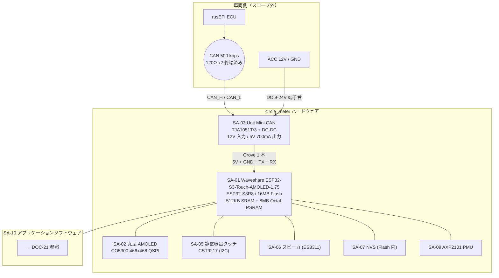
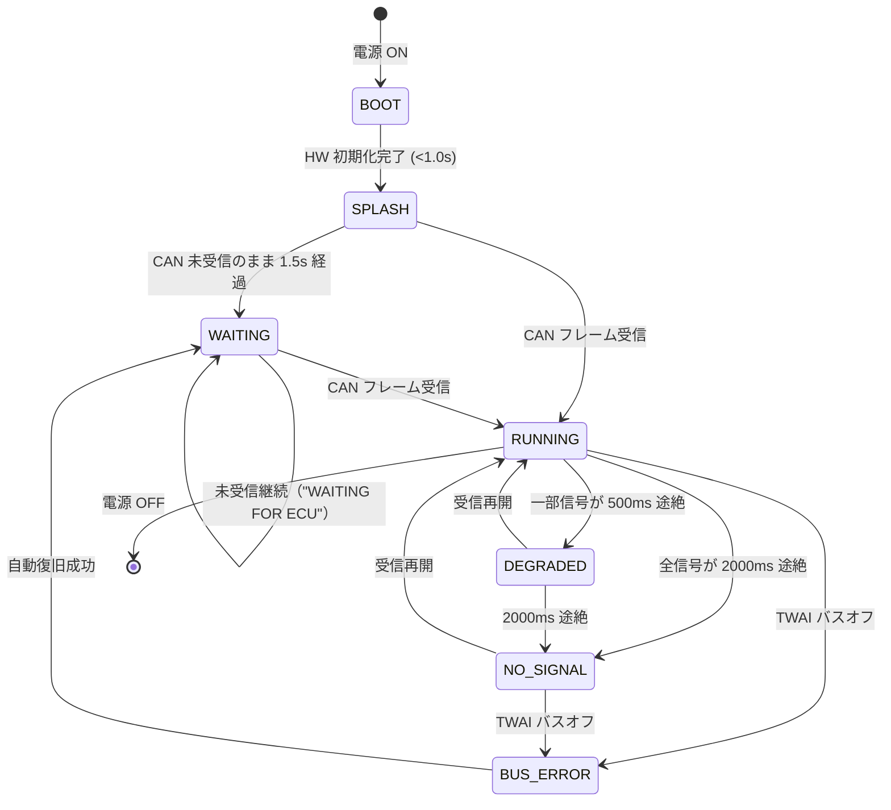

# 12. システムアーキテクチャ設計書 (SYS.3)

| 項目 | 内容 |
|---|---|
| 文書ID | `DOC-12` |
| プロセス | SYS.3 システムアーキテクチャ設計 |
| 版 | 0.1 (Draft) |
| 最終更新 | 2026-09-21 |

---

## 1. アーキテクチャ概要


```mermaid
flowchart TB
    subgraph VEH["車両側（スコープ外）"]
      ECU["rusEFI ECU"]
      BUS(("CAN 500 kbps\n120Ω x2 終端済み"))
      ACC["ACC 12V / GND"]
    end

    subgraph HW["circle_meter ハードウェア"]
      SA3["SA-03 Unit Mini CAN\nTJA1051T/3 + DC-DC\n12V 入力 / 5V 700mA 出力"]
      SA1["SA-01 Waveshare ESP32-S3-Touch-AMOLED-1.75\nESP32-S3R8 / 16MB Flash\n512KB SRAM + 8MB Octal PSRAM"]
      SA2["SA-02 丸型 AMOLED\nCO5300 466x466 QSPI"]
      SA5["SA-05 静電容量タッチ\nCST9217 (I2C)"]
      SA6["SA-06 スピーカ (ES8311)"]
      SA7["SA-07 NVS (Flash 内)"]
      SA9["SA-09 AXP2101 PMU"]
    end

    subgraph SW["SA-10 アプリケーションソフトウェア"]
      SWX["→ DOC-21 参照"]
    end

    ECU --> BUS
    BUS -->|CAN_H / CAN_L| SA3
    ACC -->|DC 9-24V 端子台| SA3
    SA3 -->|Grove 1 本\n5V + GND + TX + RX| SA1
    SA1 --- SA2
    SA1 --- SA5
    SA1 --- SA6
    SA1 --- SA7
    SA1 --- SA9
    SA1 --- SW
```

## 2. ハードウェア要素

| ID | 要素 | 型番 / 仕様 | 根拠要求 |
|---|---|---|---|
| `SA-01` | メイン基板 | Waveshare ESP32-S3-Touch-AMOLED-1.75 (ESP32-S3**R8**, 240 MHz dual core, 512 KB 内蔵 SRAM + **8 MB Octal PSRAM**, 16 MB Flash) | `CST-01` |
| `SA-02` | 表示器 | 1.75" 丸型 **AMOLED**, CO5300, **466×466**, **QSPI 4 レーン** | `SYS-10` |
| `SA-03` | CAN トランシーバ + 電源 | M5Stack Unit Mini CAN (TJA1051T/3)。端子台 9–24 V 入力、Grove へ **5 V / 最大 700 mA 出力**。トランシーバ自身の消費は 5 V で約 4 mA | `CST-02`, `SYS-01`, `STK-09` |
| ~~`SA-04`~~ | ~~入力（主）~~ | ~~ロータリーエンコーダ~~ **（廃止: v0.2 / 2026-09-28）** 本ボードには搭載されていない | — |
| `SA-05` | 入力 | 静電容量タッチ **CST9217** (I2C)。**唯一の入力手段** | `SYS-30`–`SYS-32`, `SYS-36` |
| `SA-06` | 聴覚通知 | スピーカ（ES8311 コーデック + MX1.25 2P）。ブザーではないため鳴動パターンは要設計 | `SYS-16` |
| `SA-07` | 不揮発記憶 | ESP32 NVS パーティション | `SYS-20`, `SYS-35` |
| `SA-08` | 電源 | 車両 ACC 12V → `SA-03` の DC-DC → 5 V → 本体 | `SYS-50`, `STK-09` |
| `SA-09` | 電源管理 | AXP2101 PMU。MX1.25 2P のバッテリコネクタを持ち、**小容量 LiPo でクランキング時の瞬断を吸収できる**（任意） | `SYS-51` |
| `SA-10` | ソフトウェア | 本プロジェクトのファームウェア | `DOC-21` |

## 3. GPIO 割当（ESP32-S3-Touch-AMOLED-1.75）

一次情報は公式サンプルの `examples/arduino/libraries/Mylibrary/pin_config.h`
（waveshareteam/ESP32-S3-Touch-AMOLED-1.75）。

| 機能 | GPIO | 備考 |
|---|---|---|
| AMOLED QSPI データ | G4 / G5 / G6 / G7 | CO5300 |
| AMOLED SCLK / CS / RESET | G38 / G12 / G39 | |
| I2C SDA / SCL | G15 / G14 | **タッチ・IMU・RTC・PMU が共用**。CAN には使えない |
| タッチ INT / RESET | G11 / G40 | CST9217 |
| I2S MCK / BCK / WS / DO / DI | G16（別定義で G42）/ G9 / G45 / G8 / G10 | ES8311 |
| スピーカ PA | G46 | |
| SD CLK / CMD / DATA / CS | G2 / G1 / G3 / G41 | |
| UART0 TXD / RXD | G43 / G44 | 8Pin ヘッダの UART |
| **8Pin ヘッダの GPIO 3 本** | **未確定（`OPN-08`）** | 候補は §3.0 |

### 3.0 空きピンの導出

| 除外理由 | GPIO |
|---|---|
| 存在しない | 22–25 |
| SPI Flash | 26–32 |
| **Octal PSRAM（ESP32-S3R8）** | 33–37 |
| USB | 19, 20 |
| ストラッピング | 0, 3, 45, 46 |
| ボードが使用（上表） | 1, 2, 4–12, 14–16, 38–42 |

**残る空き候補: G13 / G17 / G18 / G21 / G47 / G48**（UART の G43 / G44 を除く）。
Wiki の「8Pin ヘッダ = 3 GPIO + 1 UART」はこの中の 3 本のはずだが、
**どの 3 本かは回路図でしか分からない**（`OPN-08`）。

> G47 / G48 は多くの ESP32-S3 基板で RGB LED に使われる。本ボードでの扱いも `OPN-08` で確認する。

### 3.1 CAN 配線設計

Unit Mini CAN の端子台に車両 12V と CAN_H / CAN_L を入れ、**Grove ケーブル 1 本**で
本体へ電源と信号をまとめて渡す。M5Dial 構成より配線が減る。

| Grove 線色 | CAN Unit 側 | 本体側 | ファームウェア設定 |
|---|---|---|---|
| 黒 | GND | GND | — |
| 赤 | **5V 出力**（端子台入力から生成、最大 700 mA） | 5V 入力 | — |
| 黄 | CAN_TX | 8Pin ヘッダの GPIO（**未確定**） | `CM_TWAI_TX_GPIO` |
| 白 | CAN_RX | 8Pin ヘッダの GPIO（**未確定**） | `CM_TWAI_RX_GPIO` |

**TX/RX に使う GPIO は `OPN-08` で確定する。** §3.0 の空き候補から 2 本を取る。
ESP32-S3 の TWAI は GPIO マトリクス経由なので、候補のどれでも割り当てられる
（`SOC_GPIO_VALID_OUTPUT_GPIO_MASK == SOC_GPIO_VALID_GPIO_MASK`、S3 に入力専用ピンは無い）。
入れ替えはビルドフラグの変更だけで済むため、配線を触らずに切り分けられる。

> **UART0 (G43/G44) を CAN に使わない理由**
> 使うこと自体は可能だが、**ROM ブートローダがリセットのたびに U0TXD (G43) へログを出力する**。
> G43 をトランシーバの TXD に繋ぐと、そのログがドミナント/レセッシブの塊として
> CAN バスに出てしまい、イグニッション ON のたびにエラーフレームを撒く。
> `SYS-07`（フレームを送出しない）と `RSK-06` に反するため、8Pin ヘッダの GPIO を優先する。
> どうしても使う場合は efuse `UART_PRINT_CONTROL` でブートログを止める必要がある（不可逆）。

#### 電源

| 項目 | 値 |
|---|---|
| 入力 | 車両 12V（CAN Unit 端子台、定格 9–24 V） |
| 出力 | 5 V / 最大 700 mA（Grove） |
| 本体の想定消費 | 150–250 mA（黒基調の画面。AMOLED は黒画素がほぼ無消費） |

**5V の注入口が USB-C しか無い**ため、回路図で VBUS のテストポイントを探すか、
USB-C 端子経由で給電する（`RSK-12` / `OPN-08`）。

> **`RSK-02` / `SYS-52`**: 接続前に、車両側 CAN バスの CAN_H–CAN_L 間抵抗が **約 60 Ω**
> であることをテスターで確認する。CAN Unit 側にも終端が入っていると約 40 Ω になる。
> その場合は CAN Unit 基板上の終端抵抗を除去する。

## 4. HW / SW 機能配分

| 機能 | 実現手段 | 配分先 |
|---|---|---|
| CAN 物理層・差動信号 | TJA1051T/3 | HW (`SA-03`) |
| CAN データリンク層（ビットタイミング、ACK、エラー管理） | ESP32-S3 TWAI ペリフェラル | HW (`SA-01`) |
| フレーム ID フィルタ | TWAI アクセプタンスフィルタ（`0x200`–`0x20B` を通す） | HW + SW 設定 |
| 信号デコード・スケーリング | ソフトウェア | SW (`SWA-03`) |
| 鮮度管理・異常判定 | ソフトウェア | SW (`SWA-04`) |
| 描画 | CO5300 + ESP32-S3 **QSPI 4 レーン** DMA + ソフトウェアレンダリング | HW + SW |
| 輝度制御 | **CO5300 の調光コマンド**（AMOLED のためバックライトが無い。LEDC PWM は使えない） | HW + SW |
| 不揮発設定 | NVS | SW |

**設計判断**: フレーム ID フィルタをハードウェアのアクセプタンスフィルタで行うことで、
無関係な車両 CAN トラフィック（ロードスター NA は純正 CAN を持たないが、
将来の他 ECU 追加や rusEFI の OBD-II 応答 `0x7E8` などを想定）による割り込み負荷を削減する。

## 5. 主要な設計判断と根拠

| ID | 判断 | 代替案 | 選定理由 |
|---|---|---|---|
| `DEC-01` | 描画スタックに **M5Unified (M5GFX) + LVGL 9** を採用 | (a) M5GFX 単体で自前描画 (b) LVGL + LovyanGFX 直結 (c) TFT_eSPI | `DOC-21 §2` 参照。ページ管理・入力・設定メニューを LVGL の既製機能で賄いつつ、λ リングは自前描画で性能と意匠を確保 |
| `DEC-02` | λ リングバーは LVGL の `lv_arc` ではなく **自前 Canvas 描画**とする | `lv_arc` を多段に重ねる | 色分け・目盛・アンチエイリアスを 1 パスで描くため。`lv_arc` は色が単一で、5 色グラデ表現に多重化が必要になり負荷と実装が増える |
| `DEC-03` | CAN 受信とレンダリングを **別タスク・別コア**に分離 | 単一ループでポーリング | 描画の一時的な重さが受信取りこぼしを起こさないため (`SYS-06`) |
| `DEC-04` | TWAI を **NORMAL モードで初期化し、送信 API を一切実装しない** | Listen Only モード | 当初は Listen Only で「物理的に送信不能」にしていたが、ブリングアップで **ACK を返さないと送信側が再送を繰り返しバスオフに至る**ことが判明した（`RSK-10`）。バス上が ECU と本機の 2 ノードだけの構成では Listen Only は成立しない。ACK はプロトコルが要求する必須の参加であり、これを返すことこそが ECU を壊さない条件である。`RSK-06` は「送信 API 非実装 + 送信キュー長 0 + CI の静的検出」の 3 層で担保する |
| `DEC-05` | 描画バッファは **内蔵 SRAM の部分バッファ ×2**（全画面バッファを使わない） | PSRAM に全画面バッファ | 466×466×2 byte = **434 KB** の全画面バッファは内蔵 SRAM (512 KB) に入らない。本ボードは 8 MB Octal PSRAM を持つので物理的には置けるが、PSRAM は内蔵 SRAM より帯域が低く LVGL のフラッシュ時にボトルネックになる。**部分バッファを内蔵 SRAM に置く**方針は M5Dial 構成から変えない。バッファの行数は `OPN-12` の実測後に確定する |
| `DEC-06` | CAN デコード層を **ハードウェア非依存の純粋関数**として分離 | ドライバ内でデコード | PC 上 (`native` 環境) で単体テストを回すため (`SWE.4`) |
| `DEC-07` | 電源は ACC 連動とし、遅延 OFF やスーパーキャパシタを設けない | 常時電源 + ソフト OFF | 設定は NVS に即時保存するため、電源断で失うデータがない (`SYS-35`) |

## 6. システム状態遷移


```mermaid
stateDiagram-v2
    [*] --> BOOT: 電源 ON
    BOOT --> SPLASH: HW 初期化完了 (<1.0s)
    SPLASH --> WAITING: CAN 未受信のまま 1.5s 経過
    SPLASH --> RUNNING: CAN フレーム受信
    WAITING --> RUNNING: CAN フレーム受信
    WAITING --> WAITING: 未受信継続（"WAITING FOR ECU"）
    RUNNING --> DEGRADED: 一部信号が 500ms 途絶
    DEGRADED --> RUNNING: 受信再開
    RUNNING --> NO_SIGNAL: 全信号が 2000ms 途絶
    DEGRADED --> NO_SIGNAL: 2000ms 途絶
    NO_SIGNAL --> RUNNING: 受信再開
    RUNNING --> BUS_ERROR: TWAI バスオフ
    NO_SIGNAL --> BUS_ERROR: TWAI バスオフ
    BUS_ERROR --> WAITING: 自動復旧成功
    RUNNING --> [*]: 電源 OFF
```

| 状態 | 画面挙動 | 対応要求 |
|---|---|---|
| `BOOT` | 画面消灯（バックライト OFF でちらつきを隠す） | `SYS-19` |
| `SPLASH` | ロゴ表示。CAN 受信タスクは既に稼働 | `SYS-18` |
| `WAITING` | "WAITING FOR ECU" + 経過秒 | `SYS-45` |
| `RUNNING` | 通常表示 | — |
| `DEGRADED` | 該当信号のみグレー表示 | `SYS-40` |
| `NO_SIGNAL` | 数値を `--`、"NO SIGNAL" バナー | `SYS-41` |
| `BUS_ERROR` | "CAN ERROR" + 復旧カウンタ | `SYS-43` |

## 7. リソース予算

| リソース | 総量 | 予算 | 備考 |
|---|---|---|---|
| 内蔵 SRAM | 512 KB | LVGL 部分バッファ + LVGL ヒープ + タスクスタック | 具体値は `OPN-12` の実測後に確定する。空き 150 KB 以上を維持（`SYS-62` で監視） |
| PSRAM | **8 MB（Octal）** | フォント・ロゴ等の大きな読み出し専用データ | **描画パスには使わない**（`DEC-05`） |
| Flash | **16 MB** | アプリ 2 面（OTA 予備）+ NVS + SPIFFS | パーティション表は新規作成が必要（`DOC-40`） |
| CPU Core 0 | — | CAN 受信・デコード・鮮度管理（負荷目標 < 10 %） | |
| CPU Core 1 | — | LVGL + 描画（負荷目標 < 70 % @ 30 fps） | |

### 7.0 画素数が増えることの影響

| | M5Dial (GC9A01) | 本ボード (CO5300) | 比 |
|---|---|---|---|
| 画素数 | 57,600 | **217,156** | ×3.77 |
| 全画面バッファ (RGB565) | 112.5 KB | **434 KB** | ×3.77 |
| 表示バス | 1 レーン SPI 80 MHz | **4 レーン QSPI 80 MHz** | — |
| 全画面転送（理論値） | 約 11.5 ms | **約 10.9 ms** | ほぼ同等 |

**転送は QSPI の 4 レーン化で画素増をほぼ相殺する。** 律速になるのは
CPU 側のソフトウェアレンダリングであり、ここは画素数に比例して重くなる。

M5Dial の実測は「全画面再描画 + 転送で 17.3 ms（約 57 fps）」だった。
同じ描き方をすれば約 65 ms/フレーム = **15 fps** となり `SYS-12`（30 fps）を満たせない。
**部分描画が「望ましい」から「必須」に変わる。**

ただしこれは机上計算である。`OPN-12` として**実機で先に計測する**こと。
数字を見る前に `DOC-23` のレイアウトを作り込まない。

### 7.1 PSRAM 非搭載の確定経緯（M5Dial / 履歴）


> 以下は **M5Stack Dial v1.1 を対象としていた時期の記録**である（`CST-01` は 2026-09-28 に
> Waveshare ESP32-S3-Touch-AMOLED-1.75 へ変更された）。本ボードは 8 MB Octal PSRAM を搭載する。
> 「データシートより実測」という教訓のため残す。

一部の通販ページや第三者サイトは M5Dial の仕様を「8 MB PSRAM」と記載していたが、
**これは誤りだった**。実機ブリングアップ（2026-09-21）で以下を確認した。

```
E (115) opi psram: PSRAM ID read error: 0x00000000, PSRAM chip not found or not supported
E (116) spiram: SPI RAM enabled but initialization failed. Bailing out.
```

搭載 SoC は **ESP32-S3FN8**（`FN8` = 8 MB 内蔵 Flash / PSRAM なし）である。
`platformio.ini` から `-DBOARD_HAS_PSRAM` を外し、
`board_build.arduino.memory_type = qio_qspi` とした。

**設計への影響**: 使えるのは内蔵 SRAM 512 KB（Arduino から見えるヒープは約 320 KB）だけになる。
描画バッファ 115 KB + LVGL ヒープ 48 KB を確保しても余裕はあるが、
フォントやロゴ画像を RAM にキャッシュする余地はない。
フォント・ロゴは **Flash 上の const 配列から直接参照**する設計とする（`DOC-23 §9`）。
空きヒープは診断ページで常時監視する（`SWR-92`）。

実測値（P1 骨格ファームウェア、2026-09-21）: RAM 23,420 / 327,680 bytes (7.1 %)、
Flash 478,889 / 3,145,728 bytes (15.2 %)。
実行時の空きヒープは全画面スプライト 112.5 KB を確保した状態で **237 KB**。
LVGL の描画バッファ 115 KB + ヒープ 48 KB を確保しても十分な余裕がある。

## 8. 対象ハードウェア変更の経緯（2026-09-28）

`CST-01` を **M5Stack Dial v1.1 → Waveshare ESP32-S3-Touch-AMOLED-1.75** に変更した。

### 8.1 変更理由

M5Dial は外部に出ている GPIO が PORT.A (G13/G15) と PORT.B (G1/G2) の 4 本しかなく、
CAN で 2 本を使うと将来の拡張余地がほぼ無い。本ボードは 8Pin ヘッダに
GPIO 3 本 + UART を持ち、さらに解像度が 240×240 → 466×466 に上がる。

### 8.2 失うもの・得るもの

| | M5Dial | 本ボード |
|---|---|---|
| 解像度 | 240×240 | **466×466**（×3.77） |
| 表示 | TFT + バックライト | **AMOLED**（黒が消灯。夜間・消費電力で有利） |
| 入力 | **ロータリーエンコーダ** + タッチ | **タッチのみ** |
| 電源 | **DC 6–36 V 直結** | 5 V 単一（12V→5V は CAN Unit が担当） |
| PSRAM | なし | 8 MB Octal |
| Flash | 8 MB | 16 MB |
| バッテリ | なし | **あり**（クランキング時の瞬断を吸収できる） |

### 8.3 ロータリーエンコーダを失うことの扱い

本ボードにエンコーダは無く、外付けしようにも 8Pin ヘッダの GPIO 3 本では
CAN (2 本) と同居できない（エンコーダは A/B + ボタンで 3 本必要）。

**タッチのみで妥協する**という判断を 2026-09-28 に行った。
根拠は「サーキット走行が主用途であり、走行中に UI を触ることはまずない」ため。
これに伴い `SYS-33`（タッチのみで到達できる機能を作らない）を廃止し、
`SYS-36`（すべての機能にタッチのみで到達できること）を新設した。

走行中の誤タッチ（`RSK-07`）は、車速・回転数によるロック機構の実装も検討したが、
**受容する**判断とした。誤って切り替わってもスワイプで戻せること、
λ・EGT の表示そのものは失われないことから影響度は低い。

### 8.4 移行しても変わらないもの

`DEC-06`（ドメイン層の HW 非依存）を守ってきたため、以下は無改修で移行できる。

- `lib/rusefi_can/` / `lib/signal_model/`（単体テスト 52 件を含む）
- `lib/hal/can_driver`（ビルドフラグの GPIO 番号のみ変更）
- `tools/pcan_send.py` / `tools/bench_check.py` / Skill `bench-check`
- CI 一式（env を差し替えるだけ）
