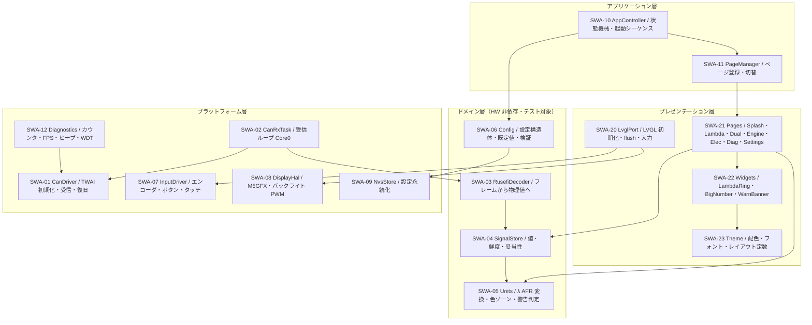
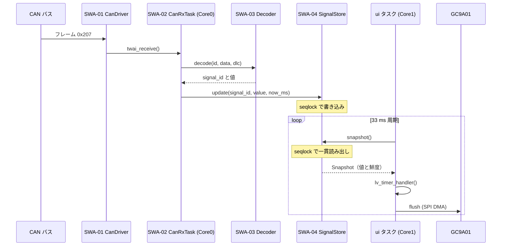

# 21. ソフトウェアアーキテクチャ設計書 (SWE.2)

| 項目 | 内容 |
|---|---|
| 文書ID | `DOC-21` |
| プロセス | SWE.2 ソフトウェアアーキテクチャ設計 |
| 版 | 0.1 (Draft) |
| 最終更新 | 2026-09-21 |

---

## 1. レイヤ構造



**依存の方向規則**: ドメイン層 (L2) は上位・下位いずれにも依存しない。
L2 は標準 C++ のみを使用し、`Arduino.h` / `esp_*` / `lvgl.h` を include しない。
これにより L2 全体が PlatformIO の `native` 環境で単体テスト可能になる（`SWR-10`, `DEC-06`）。

## 2. 描画スタックの選定（`DEC-01` のトレードオフ分析）

### 2.1 評価軸と重み

| 軸 | 重み | 根拠要求 |
|---|---|---|
| A. 30 fps の達成可能性 | x3 | `SYS-12` |
| B. M5Dial 固有 HW（エンコーダ/RTC/電源 HOLD/タッチ）の対応 | x3 | `CST-01` |
| C. ページ管理・設定メニューの実装コスト | x2 | `SYS-60`, `SWR-65` |
| D. 独自形状ウィジェット（λ リング）の表現力 | x3 | `STK-02` |
| E. メモリ消費 | x1 | リソース予算 |
| F. 保守性・情報量 | x2 | — |

### 2.2 候補比較

| 候補 | A 性能 | B HW | C ページ | D リング | E メモリ | F 保守 | 判定 |
|---|---|---|---|---|---|---|---|
| ① M5Unified(M5GFX) + LVGL 9 | ◯ 部分描画で 30 fps 可 | ◎ 公式対応 | ◎ 既製ウィジェット | ◯ canvas で自前描画可 | △ 約 +160 KB | ◎ | **採用** |
| ② M5GFX 単体（自前描画） | ◎ 最速 | ◎ | ✕ 全て自作 | ◎ 完全自由 | ◎ 最小 | △ | 次点 |
| ③ LVGL 9 + LovyanGFX 直結 | ◯ | △ パネル定義・入力を自作 | ◎ | ◯ | △ | ◯ | 不採用 |
| ④ TFT_eSPI + LVGL | △ S3 最適化が弱い | ✕ | ◎ | ◯ | △ | △ | 不採用 |
| ⑤ ESP-IDF esp_lcd + LVGL | ◎ | ✕ 全て自作 | ◎ | ◯ | ◯ | △ | 不採用 |

### 2.3 選定理由

- **① を採用**。M5GFX は LovyanGFX 派生で M5Dial を公式サポートしており、`OPN-02` 以外の
  HW 初期化（GC9A01 の SPI 設定、タッチ、エンコーダ、電源 HOLD、RTC）を自前実装せずに済む。
  これは機能要求ではなく**リスク削減**として大きい。
- **② との差は「ページ・設定メニューの実装コスト」のみ**。`SWR-61` で 6 ページ、
  `SWR-65` で 8 項目の設定メニューが必要であり、ここを自作すると工数の大半を占める。
  LVGL の `lv_menu` / `lv_roller` / `lv_group`（エンコーダ入力でのフォーカス移動）が直接使える。
- **λ リングだけは LVGL のウィジェットを使わず自前描画**する（`DEC-02`）。
  `lv_arc` は単色であり、5 色ゾーン + 目盛 + インジケータを表現するには
  複数の arc を重ねる必要があり、重ね合わせの再描画コストが増える。
  `lv_canvas` に対して 1 パスで直接ピクセルを置くほうが速く、意匠の自由度も高い。

### 2.4 性能に関する既知の注意点

- LVGL v9 は v8.3 に対して ESP32-S3 で描画性能が低下するという報告がある（lvgl/lvgl issue #5459）。
  本プロジェクトでは **LVGL のバージョンを `platformio.ini` で固定**し、
  `QT-03`（FPS 実測）を CI ではなく実機ゲートとして必ず通す。
- 30 fps を満たせない場合の後退案は「λ ページのみ LVGL を介さず M5GFX 直描画にする」。
  レイヤ構造上 `SWA-21` の 1 ページを差し替えるだけで済むよう、
  `IPage` インタフェースは LVGL のオブジェクトを外部に露出しない設計とする。
- **本機に PSRAM は無い**（`DOC-12 §7.1`）。LVGL の描画バッファ・ヒープはいずれも内蔵 SRAM から確保する。
  フォント・ロゴは RAM にコピーせず Flash 上の const 配列を直接参照する。

## 3. コンポーネント仕様

| ID | コンポーネント | 責務 | 実装場所 | 依存 |
|---|---|---|---|---|
| `SWA-01` | `CanDriver` | TWAI の初期化（Listen Only / 500 kbps / フィルタ）、フレーム受信、バスオフ復旧、エラーカウンタ取得 | `lib/hal/` | ESP-IDF `driver/twai.h` |
| `SWA-02` | `CanRxTask` | Core 0 の常駐タスク。`CanDriver` から受信 → `RusefiDecoder` → `SignalStore` 更新 | `lib/hal/` | SWA-01/03/04 |
| `SWA-03` | `RusefiDecoder` | `(id, data, dlc)` を物理値の集合に変換する純粋関数群 | `lib/rusefi_can/` | **なし（標準 C++ のみ）** |
| `SWA-04` | `SignalStore` | 全信号の 値・最終更新時刻・妥当性 を保持。スナップショット取得 API | `lib/signal_model/` | **なし** |
| `SWA-05` | `Units` | λ から AFR への変換、λ 色ゾーン判定、EGT 警告レベル判定、IIR ローパス | `lib/signal_model/` | **なし** |
| `SWA-06` | `Config` | 設定構造体、既定値、範囲検証、チェックサム | `lib/signal_model/` | **なし** |
| `SWA-07` | `InputDriver` | エンコーダ（PCNT または割り込み）、ボタン（チャタリング除去・短/長押し）、タッチ | `lib/hal/` | M5Unified |
| `SWA-08` | `DisplayHal` | M5GFX 初期化、バックライト LEDC PWM | `lib/hal/` | M5Unified |
| `SWA-09` | `NvsStore` | `Config` の NVS 読み書き | `lib/hal/` | ESP-IDF `nvs.h` |
| `SWA-10` | `AppController` | システム状態機械（`DOC-12 §6`）、起動シーケンス、タスク生成 | `src/` | 全て |
| `SWA-11` | `PageManager` | ページ登録・切替・ライフサイクル管理 | `lib/ui/` | SWA-21 |
| `SWA-12` | `Diagnostics` | 各種カウンタ、FPS 計測、ヒープ監視、WDT 登録 | `lib/hal/` | ESP-IDF |
| `SWA-20` | `LvglPort` | LVGL 初期化、flush コールバック（M5GFX へ DMA 転送）、入力デバイス登録、tick 供給 | `lib/ui/` | LVGL, SWA-07/08 |
| `SWA-21` | `Pages` | 各ページの実装（共通基底 `IPage`） | `lib/ui/` | SWA-22/23, SWA-04/05 |
| `SWA-22` | `Widgets` | `LambdaRing`, `BigNumber`, `WarnBanner`, `StatusChip` | `lib/ui/` | LVGL, SWA-23 |
| `SWA-23` | `Theme` | 配色定数、フォント、レイアウト座標 | `lib/ui/` | LVGL |

## 4. タスク・タイミング設計

| タスク | コア | 優先度 | 周期 / 駆動 | スタック | 責務 |
|---|---|---|---|---|---|
| `can_rx` | 0 | 10 | `twai_receive()` ブロッキング（タイムアウト 100 ms） | 4 KB | フレーム受信 → デコード → ストア更新 |
| `can_health` | 0 | 5 | 1000 ms 周期 | 3 KB | バスオフ検出・復旧、エラーカウンタ収集 |
| `ui` | 1 | 6 | 約 33 ms 周期（`lv_timer_handler()` の戻り値でスリープ） | 8 KB | LVGL 処理・描画・入力反映 |
| `input` | 1 | 8 | 10 ms 周期 | 3 KB | エンコーダ/ボタン読み取り、イベント投入 |

### 4.1 遅延バジェット（`SYS-13`: 120 ms 以内）

| 区間 | 想定 | 最悪 |
|---|---|---|
| ECU 送信周期（位相待ち） | 25 ms | 50 ms |
| TWAI 受信 → キュー → デコード | 1 ms 未満 | 5 ms |
| 次の UI フレームまでの待ち | 17 ms | 33 ms |
| LVGL レンダリング + SPI 転送 | 12 ms | 20 ms |
| **合計** | **約 55 ms** | **約 108 ms** — 要求充足 |

### 4.2 30 fps の成立根拠（`SYS-12`）

- GC9A01 への SPI 転送: 240 x 240 x 16 bit = 921,600 bit。SPI 80 MHz で **約 11.5 ms / 全画面**。
- 実際は部分描画のため、λ ページで毎フレーム更新される領域はリング外周帯と数値部で
  概ね全画面の 40 % 程度 → **約 4.6 ms / フレーム**。
- 支配的なのは LVGL のソフトウェアレンダリング。240 x 120 バッファ 2 面で
  DMA 転送とレンダリングをオーバーラップさせる。
- 33 ms の予算に対し余裕があるが、**机上計算を根拠とせず `QT-03` で実測して確認する**。

## 5. データフロー・並行性



### 5.1 `SignalStore` の同期方式（`SWR-26`）

**seqlock** を採用する。

- 書き込み側（CAN タスク）: `seq` を +1（奇数）→ データ書き込み → `seq` を +1（偶数）。ロックを取らない。
- 読み出し側（UI タスク）: `seq` を読む → データ読み出し → `seq` を再読。
  変化しておらず偶数なら成功、そうでなければリトライ。

**選定理由**: 書き込みが高頻度（最大 240 回/秒）かつ短時間、読み出しが低頻度（30 回/秒）。
ミューテックスでは書き込み側が UI タスクとの優先度逆転でブロックされうる。
seqlock は書き込み側が一切待たないため、CAN 受信の取りこぼし（`SYS-06`）を構造的に防げる。
スナップショットは 1 回の読み出しで全信号を取得するため、ページ内で信号間の時刻が食い違わない。

## 6. エラーハンドリング方針

| 分類 | 方針 |
|---|---|
| 回復可能（CAN バスオフ、フレーム破損） | ログ + カウンタ加算 + 自動復旧。UI に状態表示（`SWR-90`） |
| 設定データ破損 | 既定値で継続起動。起動を止めない（`SWR-81`） |
| プログラミングエラー（配列範囲外等） | `assert` で停止 → WDT リセット。リセット要因を診断ページに表示（`SWR-94`） |
| リソース枯渇（ヒープ確保失敗） | 起動時に確保するものは失敗時に即リセット。実行時の動的確保を行わない設計とする |

**方針**: 実行時の動的メモリ確保を行わない（LVGL 内部を除く）。
全バッファ・全ページオブジェクトは起動時に確保する。これにより長時間走行での
ヒープ断片化に起因するフリーズ（`DOC-10 §6` 受入基準 4）を防ぐ。

## 7. ディレクトリ構成と SWA の対応

```
circle_meter/
├── src/
│   └── main.cpp                 SWA-10 AppController
├── lib/
│   ├── rusefi_can/              SWA-03   HW 非依存・native テスト対象
│   │   ├── include/rusefi_can_spec.h    ICD の定数定義
│   │   ├── include/rusefi_decoder.h
│   │   └── src/rusefi_decoder.cpp
│   ├── signal_model/            SWA-04/05/06   HW 非依存・native テスト対象
│   │   ├── include/signal_store.h
│   │   ├── include/units.h
│   │   ├── include/config.h
│   │   └── src/
│   ├── hal/                     SWA-01/02/07/08/09/12   ESP32 依存
│   │   ├── include/
│   │   └── src/
│   └── ui/                      SWA-11/20/21/22/23   LVGL 依存
│       ├── include/
│       └── src/
└── test/
    ├── test_rusefi_can/         UT-01 から UT-04, UT-10
    └── test_signal_model/       UT-05 から UT-09, UT-11 から UT-13
```
