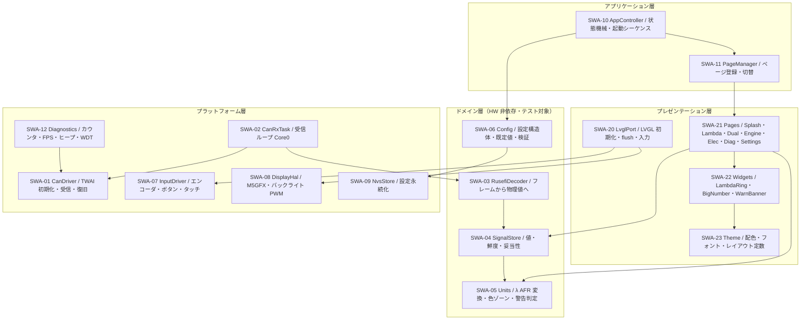
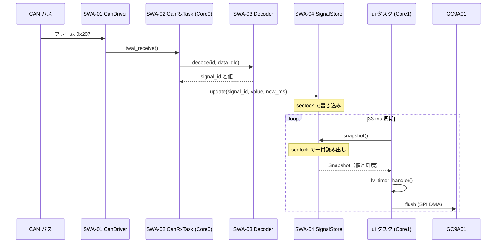

# 21. ソフトウェアアーキテクチャ設計書 (SWE.2)

| 項目 | 内容 |
|---|---|
| 文書ID | `DOC-21` |
| プロセス | SWE.2 ソフトウェアアーキテクチャ設計 |
| 版 | 0.1 (Draft) |
| 最終更新 | 2026-09-21 |

---

## 1. レイヤ構造


```mermaid
flowchart TB
    subgraph L4["アプリケーション層"]
        SWA10["SWA-10 AppController / 状態機械・起動シーケンス"]
        SWA11["SWA-11 PageManager / ページ登録・切替"]
    end
    subgraph L3["プレゼンテーション層"]
        SWA20["SWA-20 LvglPort / LVGL 初期化・flush・入力"]
        SWA21["SWA-21 Pages / Splash・Lambda・Dual・Engine・Elec・Diag・Settings"]
        SWA22["SWA-22 Widgets / LambdaRing・BigNumber・WarnBanner"]
        SWA23["SWA-23 Theme / 配色・フォント・レイアウト定数"]
    end
    subgraph L2["ドメイン層（HW 非依存・テスト対象）"]
        SWA03["SWA-03 RusefiDecoder / フレームから物理値へ"]
        SWA04["SWA-04 SignalStore / 値・鮮度・妥当性"]
        SWA05["SWA-05 Units / λ AFR 変換・色ゾーン・警告判定"]
        SWA06["SWA-06 Config / 設定構造体・既定値・検証"]
    end
    subgraph L1["プラットフォーム層"]
        SWA01["SWA-01 CanDriver / TWAI 初期化・受信・復旧"]
        SWA02["SWA-02 CanRxTask / 受信ループ Core0"]
        SWA07["SWA-07 InputDriver / エンコーダ・ボタン・タッチ"]
        SWA08["SWA-08 DisplayHal / M5GFX・バックライト PWM"]
        SWA09["SWA-09 NvsStore / 設定永続化"]
        SWA12["SWA-12 Diagnostics / カウンタ・FPS・ヒープ・WDT"]
    end

    SWA10 --> SWA11 --> SWA21 --> SWA22 --> SWA23
    SWA21 --> SWA04
    SWA21 --> SWA05
    SWA20 --> SWA08
    SWA20 --> SWA07
    SWA02 --> SWA01
    SWA02 --> SWA03 --> SWA04
    SWA04 --> SWA05
    SWA10 --> SWA06 --> SWA09
    SWA12 --> SWA01
```

**依存の方向規則**: ドメイン層 (L2) は上位・下位いずれにも依存しない。
L2 は標準 C++ のみを使用し、`Arduino.h` / `esp_*` / `lvgl.h` を include しない。
これにより L2 全体が PlatformIO の `native` 環境で単体テスト可能になる（`SWR-10`, `DEC-06`）。

## 2. 描画スタックの選定（`DEC-01` のトレードオフ分析）

### 2.1 評価軸と重み

| 軸 | 重み | 根拠要求 |
|---|---|---|
| A. 30 fps の達成可能性 | x3 | `SYS-12` |
| B. M5Dial 固有 HW（エンコーダ/RTC/電源 HOLD/タッチ）の対応 | x3 | `CST-01` |
| C. ページ管理・設定メニューの実装コスト | x2 | `SYS-60`, `SWR-65` |
| D. 独自形状ウィジェット（λ リング）の表現力 | x3 | `STK-02` |
| E. メモリ消費 | x1 | リソース予算 |
| F. 保守性・情報量 | x2 | — |

### 2.2 候補比較

| 候補 | A 性能 | B HW | C ページ | D リング | E メモリ | F 保守 | 判定 |
|---|---|---|---|---|---|---|---|
| ① M5Unified(M5GFX) + LVGL 9 | ◯ 部分描画で 30 fps 可 | ◎ 公式対応 | ◎ 既製ウィジェット | ◯ canvas で自前描画可 | △ 約 +160 KB | ◎ | **採用** |
| ② M5GFX 単体（自前描画） | ◎ 最速 | ◎ | ✕ 全て自作 | ◎ 完全自由 | ◎ 最小 | △ | 次点 |
| ③ LVGL 9 + LovyanGFX 直結 | ◯ | △ パネル定義・入力を自作 | ◎ | ◯ | △ | ◯ | 不採用 |
| ④ TFT_eSPI + LVGL | △ S3 最適化が弱い | ✕ | ◎ | ◯ | △ | △ | 不採用 |
| ⑤ ESP-IDF esp_lcd + LVGL | ◎ | ✕ 全て自作 | ◎ | ◯ | ◯ | △ | 不採用 |

### 2.3 選定理由

- **① を採用**。M5GFX は LovyanGFX 派生で M5Dial を公式サポートしており、`OPN-02` 以外の
  HW 初期化（GC9A01 の SPI 設定、タッチ、エンコーダ、電源 HOLD、RTC）を自前実装せずに済む。
  これは機能要求ではなく**リスク削減**として大きい。
- **② との差は「ページ・設定メニューの実装コスト」のみ**。`SWR-61` で 6 ページ、
  `SWR-65` で 8 項目の設定メニューが必要であり、ここを自作すると工数の大半を占める。
  LVGL の `lv_menu` / `lv_roller` / `lv_group`（エンコーダ入力でのフォーカス移動）が直接使える。
- **λ リングだけは LVGL のウィジェットを使わず自前描画**する（`DEC-02`）。
  `lv_arc` は単色であり、5 色ゾーン + 目盛 + インジケータを表現するには
  複数の arc を重ねる必要があり、重ね合わせの再描画コストが増える。
  `lv_canvas` に対して 1 パスで直接ピクセルを置くほうが速く、意匠の自由度も高い。

### 2.4 性能に関する既知の注意点

- LVGL v9 は v8.3 に対して ESP32-S3 で描画性能が低下するという報告がある（lvgl/lvgl issue #5459）。
  本プロジェクトでは **LVGL のバージョンを `platformio.ini` で固定**し、
  `QT-03`（FPS 実測）を CI ではなく実機ゲートとして必ず通す。
- 30 fps を満たせない場合の後退案は「λ ページのみ LVGL を介さず M5GFX 直描画にする」。
  レイヤ構造上 `SWA-21` の 1 ページを差し替えるだけで済むよう、
  `IPage` インタフェースは LVGL のオブジェクトを外部に露出しない設計とする。
- **PSRAM (8 MB Octal) は RGB パネルのフレームバッファ（450 KB）専用に使う**（`DEC-05`）。
  LVGL の描画バッファ・ヒープは内蔵 SRAM から確保する。フォント・ロゴは RAM にコピーせず
  Flash 上の const 配列を直接参照する。

### 2.5 ボード変更に伴う再評価（2026-10-01）

§2.1〜§2.3 の比較は M5Dial（M5Unified / M5GFX）を前提にしていた。本ボードへの変更で次が変わる。

- **評価軸 B（M5Dial 固有 HW への対応）が無効になる。** M5GFX は M5Stack 製ボード専用で、
  本ボードの「RGB 並列 + TCA9554 経由のリセット/CS + ST7701S」は対象外。
- **評価軸 A（性能）の意味が変わる。** パネルへの送出は DMA が行うので、
  問題は転送ではなく「CPU が PSRAM のフレームバッファへ描く速度」と「パネル DMA との帯域競合」になる（`§4.2`）。
- **LVGL を使う理由（C: ページ・設定メニュー・タッチ入力の既製機能）と、λ リングの自前描画（D: `DEC-02`）は変わらない。**

| 候補（本ボード） | 概要 | 状況 |
|---|---|---|
| ① LVGL 9 + `ESP32_Display_Panel` | Espressif 製。本ボードの定義 `BOARD_WAVESHARE_ESP32_S3_TOUCH_LCD_2_1`（ピン・ST7701 初期化列・タイミング）が既に入っている | **現時点の第一候補** |
| ② LVGL 9 + `esp_lcd` を直接 | IDF の RGB パネル API を直接使う。依存は最小だが初期化列・ピンを自前で持つ | 候補 |
| ③ Arduino_GFX 等による自前描画 | LVGL を使わない | ページ・設定メニューを自作することになる |
| ④ LovyanGFX | RGB パネル対応と、ST7701 + 外部 CS（IO エキスパンダ）の扱いは**要調査** | 未調査 |

選定は `OPN-15`（プラットフォームとあわせて）で行う。①が使えるなら、ピン定義と初期化列を
自前で持たずに済み、移植の手戻りが最も小さい。

## 3. コンポーネント仕様

| ID | コンポーネント | 責務 | 実装場所 | 依存 |
|---|---|---|---|---|
| `SWA-01` | `CanDriver` | TWAI の初期化（Listen Only / 500 kbps / フィルタ）、フレーム受信、バスオフ復旧、エラーカウンタ取得 | `lib/hal/` | ESP-IDF `driver/twai.h` |
| `SWA-02` | `CanRxTask` | Core 0 の常駐タスク。`CanDriver` から受信 → `RusefiDecoder` → `SignalStore` 更新 | `lib/hal/` | SWA-01/03/04 |
| `SWA-03` | `RusefiDecoder` | `(id, data, dlc)` を物理値の集合に変換する純粋関数群 | `lib/rusefi_can/` | **なし（標準 C++ のみ）** |
| `SWA-04` | `SignalStore` | 全信号の 値・最終更新時刻・妥当性 を保持。スナップショット取得 API | `lib/signal_model/` | **なし** |
| `SWA-05` | `Units` | λ から AFR への変換、λ 色ゾーン判定、EGT 警告レベル判定、IIR ローパス | `lib/signal_model/` | **なし** |
| `SWA-06` | `Config` | 設定構造体、既定値、範囲検証、チェックサム | `lib/signal_model/` | **なし** |
| `SWA-07` | `InputDriver` | エンコーダ（PCNT または割り込み）、ボタン（チャタリング除去・短/長押し）、タッチ | `lib/hal/` | M5Unified |
| `SWA-08` | `DisplayHal` | M5GFX 初期化、バックライト LEDC PWM | `lib/hal/` | M5Unified |
| `SWA-09` | `NvsStore` | `Config` の NVS 読み書き | `lib/hal/` | ESP-IDF `nvs.h` |
| `SWA-10` | `AppController` | システム状態機械（`DOC-12 §6`）、起動シーケンス、タスク生成 | `src/` | 全て |
| `SWA-11` | `PageManager` | ページ登録・切替・ライフサイクル管理 | `lib/ui/` | SWA-21 |
| `SWA-12` | `Diagnostics` | 各種カウンタ、FPS 計測、ヒープ監視、WDT 登録 | `lib/hal/` | ESP-IDF |
| `SWA-20` | `LvglPort` | LVGL 初期化、flush コールバック（M5GFX へ DMA 転送）、入力デバイス登録、tick 供給 | `lib/ui/` | LVGL, SWA-07/08 |
| `SWA-21` | `Pages` | 各ページの実装（共通基底 `IPage`） | `lib/ui/` | SWA-22/23, SWA-04/05 |
| `SWA-22` | `Widgets` | `LambdaRing`, `BigNumber`, `WarnBanner`, `StatusChip` | `lib/ui/` | LVGL, SWA-23 |
| `SWA-23` | `Theme` | 配色定数、フォント、レイアウト座標 | `lib/ui/` | LVGL |

## 4. タスク・タイミング設計

| タスク | コア | 優先度 | 周期 / 駆動 | スタック | 責務 |
|---|---|---|---|---|---|
| `can_rx` | 0 | 10 | `twai_receive()` ブロッキング（タイムアウト 100 ms） | 4 KB | フレーム受信 → デコード → ストア更新 |
| `can_health` | 0 | 5 | 1000 ms 周期 | 3 KB | バスオフ検出・復旧、エラーカウンタ収集 |
| `ui` | 1 | 6 | 約 33 ms 周期（`lv_timer_handler()` の戻り値でスリープ） | 8 KB | LVGL 処理・描画・入力反映 |
| `input` | 1 | 8 | 10 ms 周期 | 3 KB | エンコーダ/ボタン読み取り、イベント投入 |

### 4.1 遅延バジェット（`SYS-13`: 120 ms 以内）

| 区間 | 想定 | 最悪 |
|---|---|---|
| ECU 送信周期（位相待ち） | 25 ms | 50 ms |
| TWAI 受信 → キュー → デコード | 1 ms 未満 | 5 ms |
| 次の UI フレームまでの待ち | 17 ms | 33 ms |
| LVGL レンダリング + SPI 転送 | 12 ms | 20 ms |
| **合計** | **約 55 ms** | **約 108 ms** — 要求充足 |

### 4.2 30 fps の成立根拠（`SYS-12`）

**480×480 / ST7701S / RGB 16 bit 並列（フレームバッファは PSRAM）**

- パネルへの送出は GDMA が行い、**約 58.5 Hz で常時リフレッシュ**される（`DOC-12 §7.0`）。
  これはアプリの描画レートとは独立で、CPU が行うのは「フレームバッファの書き換え」だけ。
- 律速は **CPU がフレームバッファ（PSRAM）へ描く速度**と、
  **パネル DMA（約 27 MB/s）との PSRAM 帯域の競合**。
- M5Dial の実測「全画面再描画 17.3 ms」を画素数比 ×4.0 で延ばすと約 69 ms（約 14 fps）で、要求を満たせない。
  PSRAM は内蔵 SRAM より遅く、パネル DMA とも競合するので実際はこれより悪い。**部分描画が必須**になる。
- 方針: LVGL を `PARTIAL` で動かし、内蔵 SRAM の描画バッファへ変化領域だけを描き、
  フレームバッファへ書き戻す。

> **これは机上計算である。** `OPN-12` として**実機で先に計測する**こと。
> 240×240 のときも「余裕がある」と計算したうえで実測し、17.3 ms という数字を得ている。
> 今回はその余裕が無いので、計測せずに `DOC-23` のレイアウトを作り込まない。
> 計測項目は `DOC-12 §7.0` を参照（特に **NVS 書き込み中の画面の乱れ** `RSK-14`）。

#### 参考: 240×240 / M5Dial での実測（履歴）

LVGL を使わない素朴な実装（毎フレーム全画面クリア → 図形・文字描画 → 全面を 1 回で転送）:

| 項目 | 実測値 |
|---|---|
| 1 フレームの描画 + 転送 | 16.5 – 18.1 ms |
| 上限フレームレート | 約 55 – 60 fps |
| 空きヒープ | 237 KB |

## 5. データフロー・並行性


```mermaid
sequenceDiagram
    participant BUS as CAN バス
    participant DRV as SWA-01 CanDriver
    participant RX as SWA-02 CanRxTask (Core0)
    participant DEC as SWA-03 Decoder
    participant ST as SWA-04 SignalStore
    participant UI as ui タスク (Core1)
    participant LCD as GC9A01

    BUS->>DRV: フレーム 0x207
    DRV->>RX: twai_receive()
    RX->>DEC: decode(id, data, dlc)
    DEC-->>RX: signal_id と値
    RX->>ST: update(signal_id, value, now_ms)
    Note over ST: seqlock で書き込み
    loop 33 ms 周期
        UI->>ST: snapshot()
        Note over ST: seqlock で一貫読み出し
        ST-->>UI: Snapshot（値と鮮度）
        UI->>UI: lv_timer_handler()
        UI->>LCD: flush (SPI DMA)
    end
```

### 5.1 `SignalStore` の同期方式（`SWR-26`）

**seqlock** を採用する。

- 書き込み側（CAN タスク）: `seq` を +1（奇数）→ データ書き込み → `seq` を +1（偶数）。ロックを取らない。
- 読み出し側（UI タスク）: `seq` を読む → データ読み出し → `seq` を再読。
  変化しておらず偶数なら成功、そうでなければリトライ。

**選定理由**: 書き込みが高頻度（最大 240 回/秒）かつ短時間、読み出しが低頻度（30 回/秒）。
ミューテックスでは書き込み側が UI タスクとの優先度逆転でブロックされうる。
seqlock は書き込み側が一切待たないため、CAN 受信の取りこぼし（`SYS-06`）を構造的に防げる。
スナップショットは 1 回の読み出しで全信号を取得するため、ページ内で信号間の時刻が食い違わない。

#### 実装上の落とし穴（実機で踏んだ不具合）

読み出し側が「書き込み中（seq が奇数）なら即座に次の試行へ」という素朴な再試行を行うと、
**試行回数の上限に達するまでの全部が、書き込み側のクリティカルセクション 1 回の内側に
収まってしまう**ことがある。空回り 1 回は数ナノ秒しかかからないためである。
その結果、スナップショットが一度も埋められないまま返り、
「全信号が未受信 = 全部 Lost」と解釈されて、受信が正常に続いているのに
一瞬だけ `NO SIGNAL` が表示される。

対策は 2 つ。

1. **書き込み中は完了を待ってから読み出す。**
   書き込み側は数十ナノ秒で抜けるため、ここで待っても停滞しない。
2. **空のスナップショットを返さない。**
   戻り値を「直前に成功したスナップショット」で初期化しておき、
   全試行が失敗してもそれがそのまま返るようにする。
   `takenAtMs` は現在時刻にするので鮮度は正しく老い、
   本当に途絶していれば `Stale` → `Lost` に落ちる（`RSK-01` は損なわれない）。

#### seqlock の飢餓について

2 が必要なのは、seqlock には「**書き込み側のデューティが高いと読み出しが
原理的に成立しない**」という性質があるため。書き込み側がロックを取らない代償であり、
待ち方を改善しても消えない。本件では書き込みは最大 240 回/秒・1 回あたり数十ナノ秒で
デューティは 0.001 % 未満なので実機では起こらないが、
起きたときに「全信号 Lost」へ倒れる設計は危険なので、最後に読めた値を保つ側に倒す。

失敗回数は `snapshotFailures()` で公開し、診断ページに表示する（`SWR-92`）。
**実機でこれが 0 以外になったら設計の前提が崩れている**ため調査すること。

#### 回帰テスト（`UT-15`）

| テスト | 何を守るか | 旧実装での結果 |
|---|---|---|
| `no_false_lost_even_when_reader_starves` | 書き込みが飢餓を起こす頻度でも、受信済みの信号を `Lost` と報告しない | 誤 `Lost` を検出 |
| `snapshot_succeeds_under_realistic_load` | 実機相当の書き込み頻度ならスナップショットは毎回成立する | 2 万回中 789 回 失敗 |
| `snapshot_is_not_torn` | 世代が混ざらない | — |

## 6. エラーハンドリング方針

| 分類 | 方針 |
|---|---|
| 回復可能（CAN バスオフ、フレーム破損） | ログ + カウンタ加算 + 自動復旧。UI に状態表示（`SWR-90`） |
| 設定データ破損 | 既定値で継続起動。起動を止めない（`SWR-81`） |
| プログラミングエラー（配列範囲外等） | `assert` で停止 → WDT リセット。リセット要因を診断ページに表示（`SWR-94`） |
| リソース枯渇（ヒープ確保失敗） | 起動時に確保するものは失敗時に即リセット。実行時の動的確保を行わない設計とする |

**方針**: 実行時の動的メモリ確保を行わない（LVGL 内部を除く）。
全バッファ・全ページオブジェクトは起動時に確保する。これにより長時間走行での
ヒープ断片化に起因するフリーズ（`DOC-10 §6` 受入基準 4）を防ぐ。

## 7. ディレクトリ構成と SWA の対応

```
circle_meter/
├── src/
│   └── main.cpp                 SWA-10 AppController
├── lib/
│   ├── rusefi_can/              SWA-03   HW 非依存・native テスト対象
│   │   ├── include/rusefi_can_spec.h    ICD の定数定義
│   │   ├── include/rusefi_decoder.h
│   │   └── src/rusefi_decoder.cpp
│   ├── signal_model/            SWA-04/05/06   HW 非依存・native テスト対象
│   │   ├── include/signal_store.h
│   │   ├── include/units.h
│   │   ├── include/config.h
│   │   └── src/
│   ├── hal/                     SWA-01/02/07/08/09/12   ESP32 依存
│   │   ├── include/
│   │   └── src/
│   └── ui/                      SWA-11/20/21/22/23   LVGL 依存
│       ├── include/
│       └── src/
└── test/
    ├── test_rusefi_can/         UT-01 から UT-04, UT-10
    └── test_signal_model/       UT-05 から UT-09, UT-11 から UT-13
```
