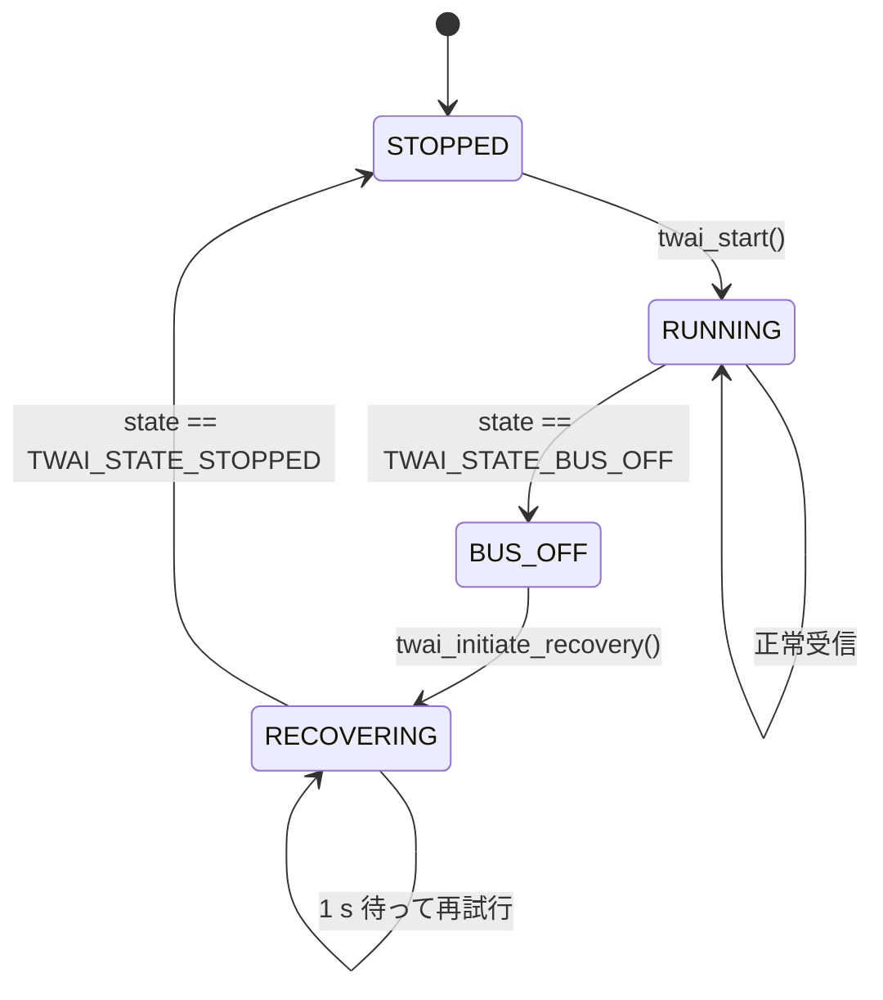

# 22. 詳細設計書 (SWE.3)

| 項目 | 内容 |
|---|---|
| 文書ID | `DOC-22` |
| プロセス | SWE.3 詳細設計・ユニット構築（テーラリング: 公開 I/F 契約と状態遷移に限定） |
| 版 | 0.1 (Draft) |
| 最終更新 | 2026-09-21 |

---

> **テーラリング方針**（`DOC-00 §3`）: 内部アルゴリズムの逐次記述は行わない。
> 実装コードとヘッダのコメントを一次成果物とし、本書は
> **① 公開 API の契約（事前条件・事後条件・不変条件）** と
> **② 状態遷移** に絞る。これらは実装を読んでも自明でないため文書化する価値がある。

## 1. `SWD-01` RusefiDecoder （`lib/rusefi_can/`）

### 1.1 データ型

```cpp
enum class SignalId : uint8_t {
    Lambda1, Lambda2, Egt1, Egt2,
    Rpm, IgnitionTiming, InjDuty, IgnDuty, VehicleSpeed,
    Map, Clt, Iat, FuelLevel,
    OilPressure, OilTemp, FuelTemp, BattVolt,
    StatusFlags, Gear,
    COUNT
};

struct DecodedSignal {
    SignalId id;
    float    value;   // 物理量（単位は DOC-13 に従う）
};

struct DecodeResult {
    uint8_t        count;                 // 有効な signal 数
    DecodedSignal  signals[8];            // 1 フレームあたり最大 8 信号
    bool           accepted;              // このフレームを処理したか
};
```

### 1.2 契約

| 関数 | 事前条件 | 事後条件 |
|---|---|---|
| `DecodeResult decodeFrame(uint32_t id, const uint8_t* data, uint8_t dlc, uint32_t baseId)` | `data != nullptr` | `dlc < 8` または `id` がベース範囲外なら `accepted == false`, `count == 0`。それ以外は `count >= 1` |
| `bool isLambdaValid(float lambda)` | — | `lambda >= 0.30f && lambda <= 5.0f` のとき `true` |
| `bool isEgtValid(float egtC)` | — | `egtC > 0.0f && egtC <= 1275.0f` のとき `true` |

### 1.3 不変条件

- 本コンポーネントは**状態を持たない**（全て純粋関数）。
- `Arduino.h` / `esp_*` / FreeRTOS を include しない。`<cstdint>` `<cstddef>` のみ。
- スケーリング定数は `rusefi_can_spec.h` に集約し、マジックナンバーをコード中に書かない。

### 1.4 スケーリング実装の注意

`0x207` の Lambda は `uint16 x 0.0001`。float で `raw * 0.0001f` とすると
raw = 10000 (λ=1.0) で `1.0000000149...` となり、`λ <= 1.03` のような境界比較で
意図しない側に倒れうる。**比較は整数の raw 値で行い、float 化は表示直前に限る**
方針とし、ゾーン判定関数は `float` 版と `raw` 版の両方を提供して
単体テスト `UT-05` で境界値の一致を確認する。

## 2. `SWD-02` SignalStore （`lib/signal_model/`）

### 2.1 データ型

```cpp
enum class Freshness : uint8_t { Lost, Stale, Fresh };

struct SignalValue {
    float     value;
    uint32_t  lastUpdateMs;
    bool      everReceived;
};

struct Snapshot {
    uint32_t     takenAtMs;
    SignalValue  s[static_cast<size_t>(SignalId::COUNT)];

    Freshness freshnessOf(SignalId id) const;   // 閾値は下表
    bool      get(SignalId id, float& out) const; // Lost なら false（値は書かない）
};
```

### 2.2 契約

| 関数 | 事前条件 | 事後条件 |
|---|---|---|
| `void update(SignalId id, float v, uint32_t nowMs)` | CAN タスクからのみ呼ぶ | `seq` が 2 増加し、偶数で終わる |
| `Snapshot snapshot(uint32_t nowMs) const` | UI タスクからのみ呼ぶ（読み出しは単一タスクに限る） | 全信号が同一の書き込み世代から読まれている。**空のスナップショット（全信号 Lost）を返さない**。再試行が全て失敗した場合は直前の成功結果をそのまま返す（`DOC-21 §5.1`） |
| `uint32_t snapshotFailures() const` | — | 再試行が全滅した回数。診断ページに表示する（`SWR-92`）。0 以外になったら seqlock の調整が必要 |
| `uint32_t Snapshot::ageMs(SignalId) const` | — | 最終更新からの経過時間。値そのものは返さないため `RSK-01` の契約に抵触しない。未受信は `0xFFFFFFFF`、未来の更新は `0` |
| `Snapshot::get()` | — | `freshnessOf(id) == Lost` のとき `false` を返し、`out` を**変更しない** |

### 2.3 鮮度判定

| 条件 | 結果 |
|---|---|
| `!everReceived` | `Lost` |
| `nowMs - lastUpdateMs < 500` | `Fresh` |
| `500 <= nowMs - lastUpdateMs < 2000` | `Stale` |
| `2000 <= nowMs - lastUpdateMs` | `Lost` |

経過時間は `ageMs()` で求める。ここには 2 つの落とし穴がある。

1. **32 bit のラップアラウンド**（約 49.7 日）。単純な大小比較ではなく差分で判定する。
2. **更新時刻が読み出し時刻より「未来」になる**ことがある。
   UI タスクは `loop()` の先頭で `millis()` を取り、描画に十数ミリ秒かけてから
   スナップショットを取るため、その間に CAN タスク（別コア）がより新しい時刻で更新する。

両方を `(int32_t)(takenAtMs - lastUpdateMs)` の**符号付き**差分で扱い、
負（= 未来の更新）は 0 とみなす。符号なし減算のままだと未来の更新が
アンダーフローして巨大な値になり、「2000 ms 以上更新なし」と誤判定される。
実機の走行模擬で `ageL = 4294967287` (= −9) として観測した（`UT-16`）。

### 2.4 不変条件（重要）

- **`Lost` の信号について値を外部に返してはならない**（`RSK-01` / `SWR-22`）。
  `get()` が `false` を返すため、呼び出し側が古い値を表示するコードを書けない。
  「値と鮮度を別々に取得する API」は**提供しない**。これは規律ではなく型で強制する。

## 3. `SWD-03` Units （`lib/signal_model/units.h`）

```cpp
enum class LambdaZone : uint8_t { RichHeavy, Rich, Optimal, Lean, LeanHeavy };
enum class EgtLevel   : uint8_t { Normal, Warn, Danger };

LambdaZone zoneOf(float lambda, const LambdaZoneConfig& cfg);
EgtLevel   levelOf(float egtC, const EgtConfig& cfg);
float      lambdaToAfr(float lambda, float stoich);
float      afrToLambda(float afr, float stoich);
float      ringRatio(float lambda, float rangeLo, float rangeHi); // 0.0 - 1.0 にクランプ
```

**境界の扱い（`UT-05` で検証）**: ゾーン境界は `下限 < λ <= 上限` の半開区間とする。
すなわち `λ == cfg.richMax` のとき `Rich`、`λ == cfg.optimalMax` のとき `Optimal`。
この規則を全境界で一貫させる。

**IIR ローパス**:
```cpp
class Lpf1 {
public:
    void  configure(float timeConstantMs);
    float update(float input, uint32_t dtMs);  // dtMs == 0 なら前回値を返す
    void  reset(float value);
};
```
入力が無効（`Lost`）になった場合、呼び出し側は `reset()` を行い、
復帰時に古い値から緩やかに追従する挙動を防ぐ（`UT-11`）。

## 4. `SWD-04` Config （`lib/signal_model/config.h`）

```cpp
struct Config {
    uint16_t version;          // CONFIG_VERSION と一致すること
    // 表示
    bool     showAfr;          // true=AFR, false=λ
    float    stoich;           // 5.0 - 20.0, 既定 14.70
    float    ringLo, ringHi;   // 既定 0.68 / 1.36
    float    zRichHeavy, zRich, zOptimal, zLean;  // 既定 0.75/0.85/1.03/1.10
    uint16_t egtWarnC, egtDangerC;                // 既定 850 / 920
    uint8_t  brightness;       // 1 - 5, 既定 4
    bool     buzzerEnabled;    // 既定 true
    uint8_t  lastPage;         // 既定 0
    // CAN
    uint16_t canBaseId;        // 既定 0x200
    uint8_t  canBitrateKbps10; // 25/50/100 (=250/500/1000 kbps), 既定 50
    bool     canExtendedId;    // 既定 false
    uint32_t crc32;            // 上記全フィールドの CRC32
};

Config   defaultConfig();
bool     validate(const Config& c);   // 範囲チェック + 単調性チェック + CRC
uint32_t computeCrc(const Config& c);
```

**単調性チェック**: `zRichHeavy < zRich < zOptimal < zLean` かつ
`ringLo < zRichHeavy` かつ `zLean < ringHi` を満たさない設定は不正とする（`UT-13`）。
設定メニューで値を変更する際も、この不変条件を破る操作はその場で拒否する。

## 5. `SWD-05` CanDriver （`lib/hal/`）

```cpp
struct CanStats {
    uint32_t rxFrames, rxDropped, queueOverflow, badDlc, unknownId;
    uint32_t busOffCount, recoveryCount;
    uint32_t tec, rec;          // TWAI エラーカウンタ
    uint32_t framesPerSec;
};

class CanDriver {
public:
    bool begin(const Config& cfg);           // NORMAL モードで初期化（送信 API は持たない）
    bool receive(twai_message_t& out, uint32_t timeoutMs);
    void poll();                             // can_health タスクから 1 s 周期
    const CanStats& stats() const;
};
```

**契約**:
- `begin()` は `TWAI_MODE_NORMAL` で初期化する。受信フレームに ACK を返すためである（`RSK-10`）。
  `TWAI_MODE_NO_ACK`（自己テスト用）は使ってはならない。
- **送信 API を公開しない。** `CanDriver` に送信メソッドを追加してはならない。
- 送信キュー長を **0** で初期化する。万一 `twai_transmit()` が呼ばれてもキューイングできない。
- `twai_transmit()` の呼び出しは**コードベース全体で禁止**とし、CI の静的チェックで検出する（`DOC-41 §3`）。

この 3 層で `RSK-06`（誤送信）を担保する。Listen Only による「物理的な送信不能」は
`RSK-10` のため採用できない（`DEC-04` を参照）。

### 5.1 バスオフ復旧の状態遷移（`SWR-90`）



`recoveryCount` は診断ページに表示する。5 回連続で復旧に失敗した場合、
`CAN ERROR` 表示を維持したまま 10 秒間隔にバックオフする（無限リトライで CPU を食わない）。

## 6. `SWD-06` InputDriver （`lib/hal/`）

```cpp
enum class InputEvent : uint8_t {
    None, EncoderCw, EncoderCcw, ButtonShort, ButtonLong, TouchTap
};
```

| 判定 | 閾値 |
|---|---|
| チャタリング除去 | 20 ms |
| 短押し | 押下 20 ms 以上、600 ms 未満で離す |
| 長押し | 押下 1500 ms 到達時点で**離す前に**発火（押しっぱなしでも 1 回のみ） |
| エンコーダ | 4 パルス = 1 ディテント。1 ディテントごとに 1 イベント |

エンコーダは取りこぼし防止のため **ESP32 の PCNT（パルスカウンタ）ユニット**で
ハードウェアカウントし、`input` タスクが 10 ms 周期でカウント差分を読む（`SWR-63`）。
M5Unified がエンコーダ読み取りを提供する場合はそれを利用し、
取りこぼしが観測された場合のみ PCNT 直叩きに切り替える。

## 7. `SWD-07` IPage / PageManager （`lib/ui/`）

```cpp
class IPage {
public:
    virtual ~IPage() = default;
    virtual const char* id() const = 0;
    virtual void onCreate(lv_obj_t* parent) = 0;   // 起動時に 1 回。オブジェクトを構築
    virtual void onShow()  = 0;                    // ページ表示時
    virtual void onHide()  = 0;                    // ページ非表示時
    virtual void onUpdate(const Snapshot& snap, const Config& cfg) = 0;  // 毎フレーム
    virtual bool onEvent(InputEvent ev) = 0;       // true = 消費した（PageManager は無視）
};
```

**契約**:
- `onCreate()` は起動時に全ページ分を 1 回だけ呼ぶ。以降 LVGL オブジェクトの
  生成・破棄を行わない（`DOC-21 §6` 動的確保禁止）。非表示ページは `lv_obj_add_flag(LV_OBJ_FLAG_HIDDEN)` で隠す。
- `onUpdate()` は**非表示ページに対して呼ばない**（無駄な計算を避ける）。
- `onEvent()` が `false` を返した場合のみ、`PageManager` がページ切替として処理する。

**新ページの追加手順**（`SYS-60` の具体化）:
1. `lib/ui/src/page_xxx.cpp` に `IPage` 実装を追加。
2. `page_registry.cpp` の配列に 1 行追加。
3. 既存ファイルの変更はこの 1 行のみ。

## 8. `SWD-08` LambdaRing ウィジェット（`lib/ui/`）

LVGL ウィジェットではなく、`lv_canvas` に直接描く描画関数として実装する（`DEC-02`）。

```cpp
struct RingStyle {
    int16_t  cx, cy;
    int16_t  rOuter, rInner;
    int16_t  startAngleDeg, sweepDeg;
    lv_color_t trackColor;
};

void ringDraw(lv_canvas_t* canvas, const RingStyle& st,
              float ratio,           // 0.0 - 1.0
              lv_color_t fillColor,
              bool showMarker);
```

**性能上の設計**:
- 毎フレーム全リングを再描画すると 22 x 円周 ≒ 15,000 px の書き換えになる。
  **前フレームの `ratio` を保持し、差分の角度範囲のみ塗り替える**。
  値が増えた場合は追加分を塗り、減った場合は減少分を `trackColor` で消す。
- ゾーン色が変わったフレームのみ全再描画する。
- これにより定常時の描画量は 1 フレームあたり数百 px に収まる。
- `lv_obj_invalidate_area()` で無効領域も差分のみに限定する。

**契約**: `ratio` は呼び出し側で `0.0 - 1.0` にクランプ済みであること（`ringRatio()` を使う）。
`ringDraw()` 内で範囲外入力を受けた場合はクランプして描画し、アサートしない
（走行中に落ちるより、誤った範囲で描くほうがまだ安全）。

## 9. アプリケーション起動シーケンス（`SWD-09`）

```mermaid
sequenceDiagram
    participant M as main / AppController
    participant D as DisplayHal
    participant N as NvsStore
    participant C as CanDriver
    participant U as LvglPort

    M->>D: begin() バックライト OFF のまま初期化
    M->>N: load(config)
    alt CRC 不正 or version 不一致
        N-->>M: false
        M->>M: config = defaultConfig(); NVS に保存
    end
    M->>C: begin(config)  ※ 先に CAN を開始する
    M->>M: xTaskCreatePinnedToCore(can_rx, Core0)
    M->>U: init(config)  LVGL + バッファ確保
    M->>U: 全ページ onCreate()
    M->>U: Splash 表示
    M->>D: バックライト ON
    M->>M: xTaskCreatePinnedToCore(ui, Core1)
    M->>M: WDT 登録
```

**順序の根拠**: `SYS-18` が「オープニング画面表示中も CAN 受信を開始していること」を要求するため、
LVGL 初期化より前に `CanDriver::begin()` とタスク生成を行う。
バックライト ON は最初の描画完了後（`DOC-23 §7`）。

## 10. ビルド時設定（ビルドフラグ）

| フラグ | 既定 | 意味 |
|---|---|---|
| `CM_TWAI_TX_GPIO` | `2` | CAN TX の GPIO（`OPN-02` で確定） |
| `CM_TWAI_RX_GPIO` | `1` | CAN RX の GPIO |
| `CM_ENABLE_CAN_SIM` | 未定義 | 定義すると CAN シミュレータを有効化（`SWR-100`） |
| `CM_FW_VERSION` | git describe | ビルド時に埋め込み（`SWR-102`） |
| `CM_LOG_LEVEL` | `3` (INFO) | シリアルログレベル |
