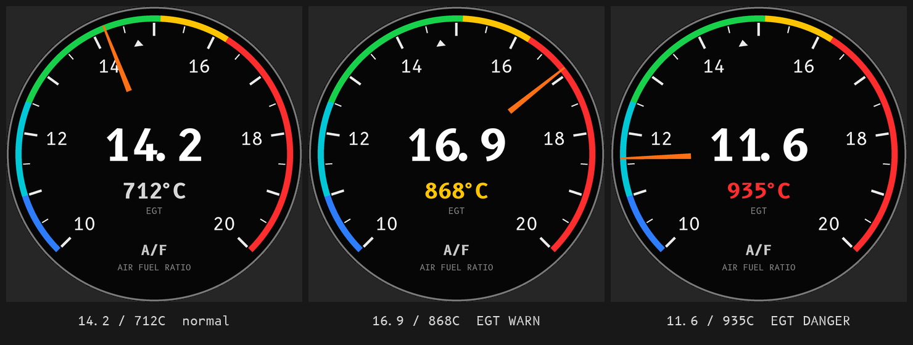
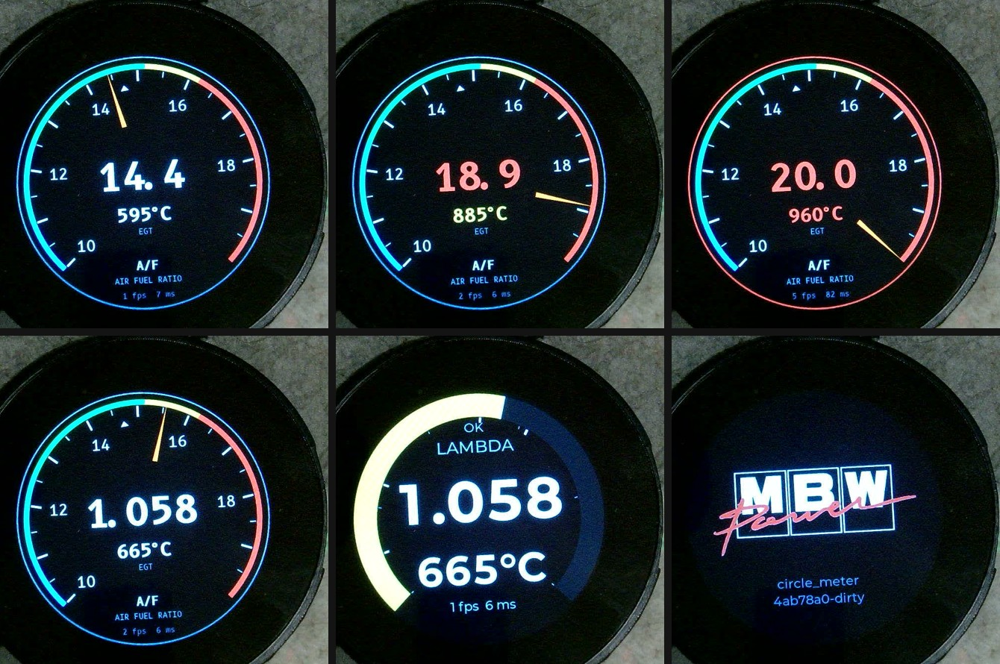
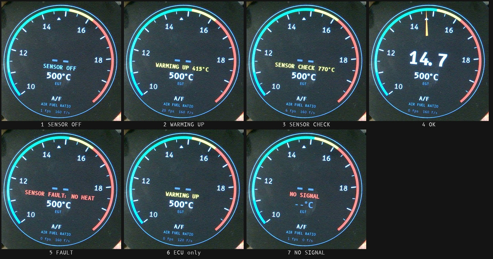

# 23. HMI 設計書（画面仕様）

| 項目 | 内容 |
|---|---|
| 文書ID | `DOC-23` |
| プロセス | SWE.2（ユーザインタフェース設計） |
| 版 | 0.1 (Draft) |
| 最終更新 | 2026-10-05 |

---

## 1. 設計原則

| 原則 | 内容 | 根拠 |
|---|---|---|
| P1. **色が第一情報** | ドライバは走行中「読む」余裕がない。周辺視野で判別できる**面積の大きい色**を主情報とし、数値は副次とする | `STK-01` |
| P2. **異常は値を消す** | 信号が失われたら灰色化 → `--` と段階的に落とす。古い値を本物のように見せない | `RSK-01` |
| P3. **黒基調** | 夜間の眩しさ低減と、色付きバーのコントラスト最大化のため背景は黒 (`#000000`) | `STK-11` |
| P4. **1 画面 1 メッセージ** | 1 ページに主情報は最大 2 つ。詰め込まない | `STK-01` |
| P5. **操作は物理ダイヤル** | タッチは補助。グローブ・振動下でも操作できること | `STK-07`, `SYS-33` |

## 2. 画面座標系

**480 x 480 円形**（ST7701S）。中心 `(240, 240)`。有効表示は半径 240 の円内。

240×240 時代の寸法を**ちょうど ×2** にして再導出した（480 = 2 × 240）。
帯の幅と文字の大きさは画面に対する比率を保つのが目的で、絶対値そのものに根拠があるわけではない。

| 領域 | 半径 | 用途 |
|---|---|---|
| ベゼル余白 | 236 – 240 | 描画しない（パネル端の歪み対策） |
| **λ リング** | **192 – 236** (帯幅 44 px) | 主バーグラフ |
| 目盛・ゾーン境界マーク | 180 – 192 | 目盛 6 本 + ゾーン境界 4 本 |
| 内周コンテンツ | 0 – 176 | 数値・ラベル・副情報 |

角度定義は LVGL 準拠（0° = 3 時方向、時計回り）。**角度は 240×240 時代から変えない。**

| 項目 | 値 |
|---|---|
| λ リング開始角 | **135°**（7 時半方向） |
| λ リング掃引角 | **270°** |
| λ リング終了角 | 405° (= 45°、4 時半方向) |
| 下部ギャップ | 45° – 135°（90°）— ステータス表示・ページインジケータに使用 |

### 2.1 縦方向のバンド割り

各要素がぶつからないよう高さ上限を与える（240×240 時代の値を ×2）。

| 要素 | 垂直中心 | 高さ上限 |
|---|---|---|
| 鮮度表示 | 68 | — |
| 単位ラベル | 104 | — |
| 主数値 | 208 | 160 px |
| 排気温度 | 336 | 88 px |
| ステータス | 404 | — |

> **検証状況（2026-10-02）**: λ ページは実機（UVC カメラ画像）で見え方を確認した。AFR `14.7` / `20.0`、
> λ `0.680` / `1.360`、EGT `845°C` / `960°C` が円に収まる。主数値の「高さ上限 160 px」は使っていない
> （実際の字の高さは AFR 98 px / λ 78 px。上限ではなく §3.4 の幅の条件が効く）。**他ページは未実装。**

## 3. λ 表示仕様（中核）

### 3.1 バーグラフ

| 項目 | 既定値 | 設定可否 |
|---|---|---|
| 表示レンジ | λ **0.68 – 1.36**（AFR 10.0 – 20.0 相当） | 可 (`SWR-65`) |
| マッピング | レンジ下端 = 開始角 135°、上端 = 終了角 405°（線形） | 不可 |
| 塗り方 | 開始角から現在値の角度まで**塗りつぶし**。未到達部は `#1A1A1A` の暗色で軌道を残す | 不可 |
| 塗り色 | 現在値が属するゾーンの色（単色）。ゾーン間でのグラデーションは行わない | — |
| 現在値インジケータ | 塗り先端に白 (`#FFFFFF`) の 3 px 幅マーカー | — |
| ピークホールド | 直近 3 秒の最リーン側位置に細い赤マーカー（Could 機能、v1.1 以降） | 可（ON/OFF） |
| レンジ外 | 下限未満 = 最小塗り、上限超過 = 満塗り（あふれさせない） | — |

> **設計判断**: 塗り色をゾーン単色にしてグラデーションを避ける理由は 2 つ。
> ① 周辺視野での判別は「色の境界」より「面全体の色」のほうが速い（P1）。
> ② グラデーションは 1 フレームごとの再計算コストが高く、`SYS-12` の 30 fps に効く。

### 3.2 色ゾーン定義（既定値）

ガソリン・理論空燃比 14.7 を前提。NA エンジン（ユーノスロードスター BP 系）を想定した配分。

| ゾーン | λ 範囲 | AFR 範囲 | 色名 | hex | 意味 |
|---|---|---|---|---|---|
| `RICH_HEAVY` | λ ≤ 0.75 | ≤ 11.0 | ディープブルー | `#2E7DFF` | 過濃。失火・カブリ域。安全だが無駄 |
| `RICH` | 0.75 < λ ≤ 0.85 | 11.0 – 12.5 | シアン | `#00C8D7` | 濃い。高負荷での冷却重視域 |
| `OPTIMAL` | 0.85 < λ ≤ 1.03 | 12.5 – 15.1 | グリーン | `#17D14B` | 適正。WOT のパワー空燃比（λ 0.85-0.90）と閉ループ（λ 1.00）の両方を含む |
| `LEAN` | 1.03 < λ ≤ 1.10 | 15.1 – 16.2 | アンバー | `#FFC400` | 希薄。低負荷なら許容、高負荷なら要注意 |
| `LEAN_HEAVY` | λ > 1.10 | > 16.2 | レッド | `#FF2D2D` | 過希薄。ノッキング・溶損のリスク |

> **`RSK-05` への対処**: 本閾値は「負荷に依存しない静的判定」である。
> 低負荷巡航での λ 1.05 は正常だが本機では `LEAN`（黄）と表示される。
> この制約を運用者（= 開発者自身）が理解していることを前提とし、
> 全閾値を設定メニューで変更可能とする（`SWR-65`）。
> v1.1 以降で MAP / TPS と連動した動的目標を検討する（スコープ外）。

### 3.3 数値表示

| 項目 | 仕様 |
|---|---|
| 位置 | 中心 `(240, 208)` 基準、水平中央揃え |
| フォント | **モード別の固定書体**（§3.4）。Montserrat Bold から生成した数字専用フォントで、AFR = **136 px**、λ = **108 px**（最悪の文字列が円に収まる最大サイズ。実機で確認済み） |
| 桁 | AFR モード: `14.7`（小数 1 桁） / λ モード: `1.000`（小数 3 桁） |
| 色 | 白 `#FFFFFF`。ただしゾーンが `LEAN_HEAVY` のときはゾーン色 |
| 単位ラベル | 数値の上、`(240, 104)`、32 px（LVGL 内蔵 Montserrat）、`#8A8A8A`。`AFR` または `LAMBDA` |
| 無効時 | `--`（`STALE` = `#5A5A5A` 表示、`LOST` = `#5A5A5A` + 下部に `NO SIGNAL`） |

### 3.4 書体の決定と数字の置き方

丸型画面では「画面に入るか」ではなく「**円に入るか**」で最大サイズが決まる。
文字列の外接矩形の上辺・下辺のうち画面中心から遠いほうを `dy` とし、
その高さで使える幅は `2 * sqrt(r^2 - dy^2)` になる（`r` は内周コンテンツの半径 176 px）。

M5Dial 版は実行時に候補を大きい順に試して自動選択していた。LCD-2.1 版は **書体を固定**にした。理由:

- LVGL 内蔵の Montserrat は 48 px までで足りない。必要な大きさのフォントを `tools/make_font.py` で生成する
  （同じ形式を Pillow だけで出力する。公式の `lv_font_conv` は Node.js が必要）
- 表示する文字が数字・`.`・`-`・`°C` に限られ、最悪の文字列を設計時に決められる
- 候補を何段も持つと生成フォントが増え（`bitmap` は 1 書体 14-37 KB）、桁単位の更新（`DEC-08`）とも相性が悪い

サイズは `python tools/make_font.py --probe` で、**最悪の文字列がすべて円に収まる最大値**を選んだ（Montserrat Bold）。

| 表示 | 書体 | 最悪の文字列 | インクの幅 / 円で使える幅 | 等幅セルの総幅 |
|---|---|---|---|---|
| AFR | **136 px**（高さ 98） | `20.0` | 296 / 313 px | 318 px |
| λ | **108 px**（高さ 78） | `0.880`（`0.680` は 306） | 310 / 322 px | 325 px |
| EGT | **76 px**（高さ 57） | `888°C`（`960°C` は 234） | 237 / 250 px | 244 px |

> M5Dial 版（Font8 / Font6 の小数倍）の見込み値は AFR 152 / λ 124 / EGT 82 px だったが、Montserrat Bold は
> 桁幅が広く、実際に収まるのは上表の大きさだった。**EGT が 4 桁（1000 °C 以上）になると円からはみ出す**が、
> `DANGER`（920 °C）を超えて 1000 °C を超える状況は想定外として許容する。

**数字は等幅のセルに置く**（`SWD-10`）。セル幅はその書体で最も広い数字の幅で、数字はセル内で中央揃えにする。
比例幅のままだと 1 桁変わるたびに文字列全体の幅と位置が変わり、全桁を描き直すことになる。
等幅セルなら、値が毎フレーム動くときに変わるのは末尾の 1 桁だけで、その 1 セル（AFR 136 px のセルは 94x98 px）だけを再描画する。
セルの総幅はインクの幅より広い（字の左右の余白を含む）ので、`BigNumber` の領域幅はセル総幅以上にする（AFR 320 / λ 328 / EGT 248 px）。

各要素の垂直方向の割り当ては §2.1 を参照。

### 3.5 表示デザイン A（指針式・大森風）（`SYS-21` (b) / `SWR-49`）

車両の純正メーター（黒盤・白い数字・白い針、外周に色帯のある小径メーター）と揃えるためのデザイン。
リング（§3.1）と同じ λ レンジ・同じ角度（135° から 270°）・同じゾーン境界を使い、**表すものは同じで描き方だけが違う**。

| 要素 | 半径・位置 | 仕様 |
|---|---|---|
| 背景 | 全面 | `#060606` |
| リム | 236-239 | `#787878` の細い線。EGT `DANGER` のときは `#FF2D2D` で 2 Hz 点滅（`SWR-46`） |
| 色帯 | 215-225（幅 10） | 5 ゾーンの色（§3.2）。針の先端がこの帯に重なり、色で現在のゾーンを示す |
| 目盛り | 大 192-213 / 小 202-213 | AFR 1.0 ごとに大（幅 4）、0.5 ごとに小（幅 2）。`#EBEBEB` |
| 理論空燃比マーク | 177-187 | AFR 14.7 の位置に白い三角 |
| 目盛り数字 | 半径 160 | `10 12 14 16 18 20`（λ 表示のときも AFR で刻む）。B612 Mono Regular 28 px、`#F0F0F0` |
| 針 | 110-224 | オレンジ `#FF7014`。根元の幅 9 px から先端に向けて細くなる三角形。中心から浮かせる（中心の数値と重ならない） |
| 主数値 | 中心 (240, 226) | B612 Mono Bold 70 px、白。AFR `14.2` / λ `1.000`。`LEAN_HEAVY` のときは赤（§3.3 と同じ規則） |
| EGT | 中心 (240, 300) | B612 Mono Bold 34 px。色は §4 と同じ（通常 `#E0E0E0` / 警告 `#FFC400` / 危険 `#FF2D2D` 点滅） |
| 銘板 | (240, 332) `EGT`、(240, 396) `A/F`、(240, 424) `AIR FUEL RATIO` | B612 Mono。針が通らない下部 90° の空き（45°-135°）と中心付近にだけ置く |
| 信号喪失 | — | `Lost`: 針を消し、主数値を `--`（灰）、`NO SIGNAL`（赤）を (240, 362) に出す。`Stale`: 針と数値を灰色 `#5A5A5A` |

**数字は等幅**（`SWR-50`）。B612 Mono は全数字が同じ幅で、値がパラパラ動いても桁の位置が変わらない（航空機の HUD と同じ考え方）。
等幅書体では小数点や `°` も数字と同じ幅になり `14. 2` と間が空くので、この 2 文字だけ数字セルの 0.62 / 0.70 倍の固定幅にする。
固定幅なので、値が変わっても小数点の位置は動かない。

書体: `assets/fonts/B612Mono-*.ttf`（SIL OFL 1.1）を `tools/make_font.py` で生成する（主数値 Bold 70 px / EGT Bold 34 px / 目盛り数字 Regular 28 px / 銘板 Bold 22 px・Regular 14 px）。

> カメラは白を水色に、灰を青に寄せて写す（`DOC-40 §2.4.1`）。実物の色は試作画像に近い。

## 4. 排気温度 (EGT) 表示仕様

| 項目 | 仕様 |
|---|---|
| 位置（λ メインページ） | 中心下部 `(240, 336)` |
| フォント | 固定書体 **76 px**（§3.4）。`845°C` のインクの幅は 232 px |
| 桁 | 整数 3 桁（例 `845°C`）。分解能は 5 °C だが表示は 1 °C 単位（ローパス後の値） |
| 色 | `NORMAL` = `#E0E0E0` / `WARN` = `#FFC400` / `DANGER` = `#FF2D2D`（点滅 2 Hz） |
| 閾値（既定） | `WARN` ≥ **850 °C** / `DANGER` ≥ **920 °C** | いずれも設定可 |
| 無効時 | `--°C`（グレー） |

> **既定閾値の根拠**: ロードスター NA (BP-ZE/BP-4W) の自然吸気・触媒前計測を想定。
> 連続 900 °C 超は排気バルブ・触媒への負担が大きい。ターボ化やセンサ位置の変更時は
> 設定で調整すること。数値そのものは車両とセンサ位置に強く依存するため、
> 実車でのログ取得後に見直すこと（`OPN-03` 完了後）。

### 4.1 `DANGER` 時の全画面警告（`SWR-46`）

- λ リングの外側（半径 118-120 の余白帯）を赤で塗り、2 Hz で点滅。
- ブザーを 2 Hz で断続吹鳴（設定で消音可。既定は **ON**）。
- 現在ページに関わらず表示する（診断・設定ページを除く）。

## 5. ページ構成（`SWR-61`）

ダイヤル回転で以下の順に循環。

| # | ページ ID | 主情報 | 副情報 | ボタン短押しの機能 |
|---|---|---|---|---|
| 0 | `PAGE_LAMBDA` | λ リング + 大数値 | EGT 数値 | **AFR / λ 表示切替**（`SYS-14`） |
| 1 | `PAGE_DUAL` | λ リング（外） + EGT リング（内 r 72-88） | λ / EGT 数値を上下に分割 | AFR / λ 表示切替 |
| 2 | `PAGE_ENGINE` | 水温（大） | 回転数・吸気温・MAP | 単位切替なし（予約） |
| 3 | `PAGE_ELEC` | バッテリ電圧（大） | 油圧・油温 | 予約 |
| 4 | `PAGE_DIAG` | 受信フレーム/秒・FPS | 破棄数・TEC/REC・復旧回数・空きヒープ・稼働時間・FW 版数 | カウンタリセット |
| — | `PAGE_SPLASH` | ロゴ | 版数 | — （自動遷移のみ） |
| — | `PAGE_SETTINGS` | 設定メニュー | — | 長押し 1.5 秒で入退出（`SYS-32`） |

- 起動時は `PAGE_SPLASH` → NVS に保存された最終ページへ復帰（`SYS-35`）。既定は `PAGE_LAMBDA`。
- 下部ギャップ（45°–135°）にページインジケータ（ドット 5 個）を描画。

## 6. ステータス表示（下部ギャップ領域）

| 状態 | 表示 | 色 |
|---|---|---|
| `RUNNING` | ページインジケータのみ | `#3A3A3A` / 現在ページ `#FFFFFF` |
| `WAITING` | `WAITING FOR ECU` + 経過秒 | `#FFC400` |
| `DEGRADED` | 該当信号の数値をグレー化。ギャップ部に `STALE` | `#8A8A8A` |
| `NO_SIGNAL` | `NO SIGNAL`（λ センサの状態と同じく中央。§6.1） | `#FF2D2D` |
| `BUS_ERROR` | `CAN ERROR (n)` n = 復旧試行回数 | `#FF2D2D` |
| CEL 点灯 | 左下に `CEL` チップ | `#FFC400` |
| λ プロテクト作動 | 右下に `LAMBDA PROT` チップ | `#FF2D2D` |

### 6.1 λ センサの状態（`SYS-22` / `SWR-51`）

CAN は受信しているが λ が無効のとき、`NO SIGNAL` の代わりに次を出す。リングの塗り・針・主数値（`--`）は出さない。
位置は**主数値と EGT の間**（リング: (240, 282) / 指針式 A: (240, 262)）。λ が無効な間は針もリングの塗りも出さないので、中央が空いている。**改訂（2026-10-05）**: 当初は下部（リング: (240, 404) / 指針式 A: (240, 362)）に置いたが、実機のカメラ画像で、長い文字列が指針式 A では左下の目盛り数字「10」と重なり、リングではリングの右端と重なる位置だったため移した。下部には診断文字列（デモの fps など）だけを置く。

| 状態 | 表示 | 色 | いつ |
|---|---|---|---|
| `SensorOff` | `SENSOR OFF` | `#8A8A8A` | エンジン停止中（ヒータ許可なし。WBO は `Preheat`） |
| `WarmingUp` | `WARMING UP 520°C`（WBO の温度があるとき）/ `WARMING UP` | `#FFC400` | 加熱中 |
| `Check` | `SENSOR CHECK 780°C` | `#FFC400` | WBO は正常（閉ループ）だが λ が無効（ネルンスト電圧が範囲外など） |
| `FaultNoHeat` | `SENSOR FAULT: NO HEAT` | `#FF2D2D` | WBO が「加熱しない」 |
| `FaultOverheat` | `SENSOR FAULT: OVERHEAT` | `#FF2D2D` | 過熱 |
| `FaultUnderheat` | `SENSOR FAULT: UNDERHEAT` | `#FF2D2D` | 温度不足 |
| `NoWbo` | `NO WBO DATA` | `#FF2D2D` | ECU のフレームは届くが WBO のフレームが 2 秒届いていない |
| `NoSignal` | `NO SIGNAL` | `#FF2D2D` | ECU のフレームも WBO のフレームも 2 秒届いていない（通信異常） |

> 文言は英大文字（§9 の方針）。温度は整数 °C。最長の `SENSOR FAULT: UNDERHEAT`（23 文字。B612 Mono 22 px で約 304 px）は、指針式 A の (240, 262) で目盛り数字「12」「18」（半径 160）の内側に収まる。

## 7. オープニング画面（`SYS-18`, `SWR-48`）

| 項目 | 仕様 |
|---|---|
| 構成 | 中央にロゴ、下部に `circle_meter` と FW 版数（`v0.1.0-3-gabc1234`） |
| ロゴ形式 | `assets/logo_src.png` を `tools/make_logo.py` で RGB565 の C++ 配列に変換して保持する。M5Dial 版は `assets/logo.cpp`（204x87 px / 34.7 KB）。**LCD-2.1 版は `assets/lcd21/logo.cpp` / `logo.h`（394x167 px / 129 KB）**。生成: `python tools/make_logo.py --out-c assets/lcd21/logo.cpp --out-h assets/lcd21/logo.h --max-width 408 --max-height 174`（元画像の縦横比で 394x167 になる）。Flash 上の const 配列を LVGL の `lv_image_dsc_t`（RGB565）から直接参照し、RAM へコピーしない |
| アニメーション | 0.0–0.8 s フェードイン → 1.6 s 保持 → 0.6 s フェードアウト（合計 3.0 s）。**バックライトの LEDC PWM（GPIO6）のランプで実現**する（画素のアルファ合成は 16 bit 階調では縞が出るうえ CPU を食う） |
| 短縮条件 | フェードイン完了時点で CAN 受信済みなら保持を 1.6 s → 0.4 s に短縮する |
| 差し替え | `assets/logo_src.png` を置き換えて `python tools/make_logo.py` を実行する |

**注意**: `SYS-19`（初回描画 2.0 秒以内。2026-10-02 に 1.0 秒から改訂）を満たすため、ロゴ表示の前に
バックライトを OFF のまま画面を黒でクリアし、ロゴ描画完了後にバックライトを ON にする
（起動時のちらつき・残像対策）。本画面へ遷移する際も同様に、
描画を終えてからバックライトを戻す。

### 7.1 ロゴの輝度反転について

元素材は白背景に黒文字のロゴである。これをそのまま出すと黒基調の丸型画面に
白い四角が浮いてしまい、原則 P3 に反する。そこで `tools/make_logo.py` は既定で
**白地の画素を「黒インク」と「色インク（スクリプトの赤）」の混合とみなして割合を求め、
黒地の上で黒インク -> 白、色インク -> そのままの色として塗り直す**。
結果として「黒地に白抜きの MBW + 赤のスクリプト」になる。色インクの色は彩度の高い画素の中央値から推定する
（元画像では RGB 196 / 34 / 35）。

> **履歴（2026-10-04）**: 当初は画素ごとに「有彩色なら残す / 無彩色なら反転」と切り替えていた。
> この方式では赤字の縁の中間色（赤と白の間の薄いピンク）が反転されずに残り、黒地の上で明るい縁取りが
> 浮いて POWER の縁がジャギーに見えた。混合比で塗り直す方式にして、縁が黒地へなめらかに溶けるようにした。

元のまま（白背景）にしたい場合は `python tools/make_logo.py --no-invert` で再生成する。

## 8. 配色パレット（`SWA-23` Theme の定数）

| 用途 | 定数名 | hex |
|---|---|---|
| 背景 | `CM_COLOR_BG` | `#000000` |
| リング軌道（未到達部） | `CM_COLOR_TRACK` | `#1A1A1A` |
| 主テキスト | `CM_COLOR_TEXT` | `#FFFFFF` |
| 副テキスト | `CM_COLOR_TEXT_SUB` | `#8A8A8A` |
| 無効・鮮度切れ | `CM_COLOR_DISABLED` | `#5A5A5A` |
| ゾーン RICH_HEAVY | `CM_COLOR_RICH_HEAVY` | `#2E7DFF` |
| ゾーン RICH | `CM_COLOR_RICH` | `#00C8D7` |
| ゾーン OPTIMAL | `CM_COLOR_OPTIMAL` | `#17D14B` |
| ゾーン LEAN | `CM_COLOR_LEAN` | `#FFC400` |
| ゾーン LEAN_HEAVY | `CM_COLOR_LEAN_HEAVY` | `#FF2D2D` |
| 警告（EGT WARN） | `CM_COLOR_WARN` | `#FFC400` |
| 危険（EGT DANGER） | `CM_COLOR_DANGER` | `#FF2D2D` |

## 9. フォント計画

| 用途 | フォント | サイズ | 収録文字 | 生成方法 |
|---|---|---|---|---|
| 主数値 AFR | Montserrat Bold | **136 px** | `0123456789.-` | `tools/make_font.py` -> `assets/lcd21/fonts/cm_font_afr.c`（37 KB） |
| 主数値 λ | Montserrat Bold | **108 px** | `0123456789.-` | 同上 -> `cm_font_lambda.c`（24 KB） |
| 排気温度 | Montserrat Bold | **76 px** | `0123456789-°C` | 同上 -> `cm_font_egt.c`（14 KB） |
| ラベル・ステータス | LVGL 内蔵 `montserrat_24` / `montserrat_32` | 24 / 32 px | ASCII | 内蔵（`lv_conf.h` で有効化） |
| 設定メニュー | LVGL 内蔵（`P5` で決める） | — | ASCII | 内蔵 |

元の TTF は `assets/fonts/Montserrat-Bold.ttf`（SIL OFL 1.1。`assets/fonts/README.md`）。LVGL 9.2.2 の
`demos/multilang/assets/fonts/` に同梱のものを使った。フォントは 4 bpp・非圧縮で、1 書体 14-37 KB。

> 日本語表示は行わない（フォント容量と視認性の観点から、全ラベルを英大文字とする）。

## 10. 輝度制御（`SYS-20`, `SWR-47`）

| レベル | PWM デューティ | 想定用途 |
|---|---|---|
| 1 | 10 % | 夜間 |
| 2 | 25 % | 薄暮 |
| 3 | 50 % | 曇天 |
| 4 | 75 % | 晴天 |
| 5 | 100 % | 直射日光下 |

設定メニューで手動選択。既定はレベル 4。自動調光（照度センサ）は本体に光センサがないため実装しない。

> バックライトは **GPIO6 の LEDC PWM** で制御する（`SWR-47`）。上表の「PWM デューティ」はそのまま使える。

## 11. 本 HMI 設計の検証項目

| 検証 ID | 内容 |
|---|---|
| `QT-02` | 全ページのレイアウトが仕様通りに描画されること（写真比較） |
| `QT-03` | λ ページで 30 fps 以上 |
| `QT-05` | EGT 危険域で赤点滅・ブザーが作動すること |
| `QT-06` | オープニング画面の表示が 3.0 秒（±100 ms）で、初回描画が電源投入から 2.0 秒以内 |
| `QT-08` | 昼間の直射日光下で外周バーの色が運転席から判別できること（主観評価、合否は開発者判断） |
| `QT-09` | 夜間に眩しくないこと（輝度レベル 1 で主観評価） |
