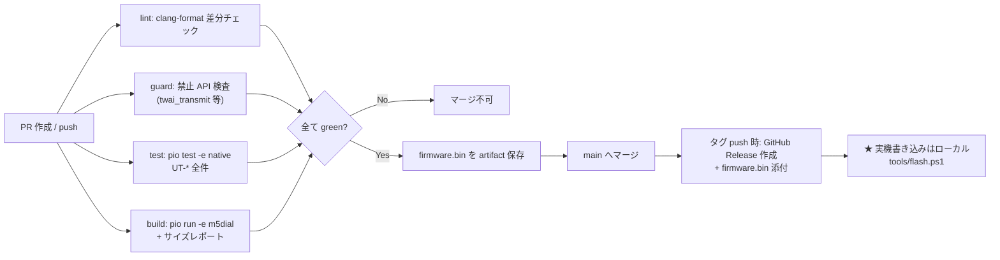

# 40. 構成管理・開発環境定義書 (SUP.8)

| 項目 | 内容 |
|---|---|
| 文書ID | `DOC-40` |
| プロセス | SUP.8 構成管理 / SUP.9 問題解決 / SUP.10 変更要求 / MAN.3 プロジェクト管理 / SPL.2 リリース |
| 版 | 0.1 (Draft) |
| 最終更新 | 2026-09-21 |

---

## 1. 構成アイテム一覧

構成管理の対象（= git で版管理し、リリース時に版数が確定するもの）。

| 分類 | 構成アイテム | 場所 | 版管理 |
|---|---|---|---|
| 文書 | ASPICE 文書一式 | `docs/*.md` | git |
| ソース | ファームウェア | `src/`, `lib/` | git |
| テスト | 単体テスト | `test/` | git |
| ビルド定義 | `platformio.ini`, `partitions.csv`, `sdkconfig` 相当 | ルート | git |
| CI 定義 | GitHub Actions ワークフロー | `.github/workflows/` | git |
| ツール | 書き込み・ログ・変換スクリプト | `tools/` | git |
| 資産 | ロゴ・フォント | `assets/` | git（生成元 PNG と生成物 C の両方） |
| 外部依存 | PlatformIO platform / ライブラリ | `platformio.ini` に**バージョン固定**して記録 | git（`pio pkg` のロック相当） |
| 成果物 | `firmware.bin`, `firmware.elf` | GitHub Release / Actions artifact | タグに紐付け |

### 1.1 外部依存のバージョン固定方針

再現可能なビルドのため、以下は**必ずバージョンを明示**する（`^` や `latest` を使わない箇所を明記）。

| 依存 | 指定 | 固定の理由 |
|---|---|---|
| `platform` (espressif32) | 完全固定（例 `6.9.0`） | Arduino core / ESP-IDF のバージョンが変わると TWAI API・メモリ配置が変わる |
| `lvgl` | 完全固定（例 `9.2.2`） | v9 系で描画性能の差がある（`DOC-21 §2.4`）。FPS 実測結果とバージョンを対応付ける |
| `M5Dial` / `M5Unified` / `M5GFX` | 完全固定 | パネル初期化パラメータが変わると表示が崩れる |

依存を更新する際は**必ず `QT-03`（FPS 実測）を再実行**し、結果を PR に記載する。

## 2. 開発環境

### 2.1 前提環境（ホスト）

| 項目 | 値 | 確認コマンド |
|---|---|---|
| OS | Windows 11 | — |
| シェル | PowerShell 7 / Git Bash | — |
| Git | 2.52 以降 | `git --version` |
| Python | 3.11 以降（確認済: 3.13） | `python --version` |
| PlatformIO Core | 6.1 以降 | `pio --version` |
| GitHub CLI | 2.x（任意、PR 操作用） | `gh --version` |
| エディタ | VS Code + PlatformIO IDE 拡張（任意） | — |

### 2.2 初回セットアップ

```bash
python -m pip install --user --upgrade platformio
```

インストール後、`pio` が PATH に無い場合は `python -m platformio` で代用できる。
本プロジェクトのスクリプトは `pio` が無ければ自動的に `python -m platformio` へフォールバックする。

依存パッケージ（ツールチェーン・ライブラリ）は初回ビルド時に自動取得される。

```bash
pio run -e m5dial          # ファームウェアビルド（初回は 5-10 分）
pio test -e native         # ドメイン層の単体テスト（PC 上で実行）
```

### 2.3 ターゲット環境

| 項目 | 値 |
|---|---|
| ボード | M5Stack Dial v1.1（M5StampS3 / ESP32-S3FN8） |
| PlatformIO board | `m5stack-stamps3` |
| framework | `arduino` |
| Flash | 8 MB, QIO, 80 MHz |
| PSRAM | **なし**（ESP32-S3FN8）。`memory_type = qio_qspi` |
| パーティション | `partitions_8mb.csv`（app0 3 MB / app1 3 MB / nvs / spiffs） |
| CPU | 240 MHz |
| USB | ESP32-S3 ネイティブ USB-CDC（USB-C 直結） |

### 2.4 書き込み手順

M5Dial は ESP32-S3 のネイティブ USB を使用するため、通常は専用ドライバ不要で
`USB シリアルデバイス (COMx)` として認識される。

```bash
pio run -e m5dial -t upload
```

ポートが自動検出されない場合、または書き込みモードに入らない場合:

1. `pio device list` でポートを確認する。
2. M5Dial の**リセットボタンを押しながら USB を接続**してダウンロードモードに入る。
3. `pio run -e m5dial -t upload --upload-port COM5` のようにポートを明示する。

### 2.5 車両に接続せずに開発する方法（`SYS-61` / `SWR-100`）

| 手段 | 用途 | 使い方 |
|---|---|---|
| **native 単体テスト** | デコード・鮮度管理・単位換算のロジック検証 | `pio test -e native` |
| **CAN シミュレータ（内蔵）** | 実機で UI の見た目と FPS を確認 | `pio run -e m5dial_sim -t upload`（λ・EGT をスイープ） |
| **CAN フレーム再生** | ベンチで実バスを模擬（`QT-*`） | 別の CAN 機器（USB-CAN アダプタ等）から `tools/replay/*.csv` を送出 |

`tools/replay/` の CSV 形式:

```
# time_ms, can_id(hex), dlc, d0, d1, d2, d3, d4, d5, d6, d7
0,207,8,10,27,00,00,00,00,00,00
50,209,8,A9,00,00,00,00,00,00,00
```

## 3. ブランチ戦略・コミット規約

### 3.1 ブランチ

| ブランチ | 用途 | 保護 |
|---|---|---|
| `main` | 常にビルド可能・実機で動作する状態を保つ | **直接 push 禁止**。PR 経由のみ |
| `feat/<topic>` | 機能追加 | — |
| `fix/<topic>` | 不具合修正 | — |
| `docs/<topic>` | 文書のみの変更 | — |
| `chore/<topic>` | ビルド・CI・依存更新 | — |

### 3.2 コミットメッセージ

Conventional Commits に準拠する。

```
<type>(<scope>): <要約>

<本文（任意）>

Refs: SWR-07, UT-02
```

- `type`: `feat` / `fix` / `docs` / `test` / `chore` / `refactor` / `perf`
- `scope`: `can` / `signal` / `ui` / `hal` / `build` / `docs`
- **要求 ID を `Refs:` 行に書く**。これが `DOC-50` トレーサビリティの実データになる。

### 3.3 バージョニング

セマンティックバージョニング `vMAJOR.MINOR.PATCH`。git タグで付与。

| 増分 | 条件 |
|---|---|
| MAJOR | CAN インタフェース仕様（`DOC-13`）の非互換変更、設定構造体の非互換変更 |
| MINOR | ページ追加・機能追加 |
| PATCH | 不具合修正・文書修正 |

ファームウェアには `git describe --tags --always --dirty` の結果を埋め込む（`SWR-102`）。

## 4. CI/CD

### 4.1 パイプライン構成



### 4.2 ジョブ定義

| ジョブ | 実行環境 | 内容 | 失敗時 |
|---|---|---|---|
| `lint` | ubuntu-latest | `clang-format --dry-run -Werror` | マージ不可 |
| `guard` | ubuntu-latest | `twai_transmit` / `twai_start`(送信モード) の混入検査（`RSK-06`） | マージ不可 |
| `test` | ubuntu-latest | `pio test -e native` | マージ不可 |
| `build` | ubuntu-latest | `pio run -e m5dial -e m5dial_sim` + Flash/RAM 使用量をジョブサマリに出力 | マージ不可 |
| `release` | ubuntu-latest | タグ push 時のみ。`firmware.bin` `firmware.elf` を Release に添付 | — |

### 4.3 実機への書き込みが CI に含まれない理由

GitHub Actions のランナーは M5Dial に物理接続できない。
**書き込みはローカル実行**とし、Claude Code から以下を呼べるようにする。

| スクリプト | 内容 |
|---|---|
| `tools/build.ps1` | `pio run -e m5dial` |
| `tools/test.ps1` | `pio test -e native` |
| `tools/flash.ps1 [-Port COM5] [-Sim]` | ビルド + 書き込み。`-Sim` で CAN シミュレータ版 |
| `tools/monitor.ps1 [-Port COM5]` | シリアルモニタ（115200 bps） |
| `tools/flash_and_monitor.ps1` | 書き込み後そのままモニタ |

これらは `.claude/settings.json` の `permissions.allow` に登録済みであり、
Claude Code から都度の承認なしに実行できる（`SUP.8` としての「自動ビルド・書き込み」の実体）。

将来、自宅に常設のセルフホストランナー（USB で M5Dial を接続した PC）を置けば
`build` の後段に `flash` ジョブを追加して完全自動化できる。本フェーズでは対象外。

### 4.4 Claude Code から実行する典型フロー

```bash
tools/test.ps1          # ロジック変更後: まず単体テスト
tools/build.ps1         # ビルドが通るか
tools/flash.ps1         # 実機へ書き込み
tools/monitor.ps1       # 起動ログと診断出力を確認
```

## 5. 問題解決管理 (SUP.9) / 変更要求管理 (SUP.10)

GitHub Issues で一元管理する。文書は作らず、ラベルで区別する。

| ラベル | 意味 | 必須記載事項 |
|---|---|---|
| `bug` | 不具合 | 再現手順、期待動作、実際の動作、FW 版数、違反している要求 ID |
| `change-request` | 仕様変更要求 | 変更理由、影響を受ける要求 ID、影響範囲の見積 |
| `question` | 未解決事項（`OPN-*`） | — |
| `risk` | リスク（`RSK-*`） | 影響度・発生度・対策 |

**変更要求の処理規則**:
1. 要求（`STK-*` / `SYS-*` / `SWR-*`）を変更する場合、**先に文書を更新する PR** を出す。
2. 文書 PR がマージされてから実装 PR を出す。
3. 実装 PR のコミットに `Refs: <変更後の要求 ID>` を記載する。

これにより「実装が先に進んで文書が置き去りになる」ことを構造的に防ぐ。

## 6. リリース手順 (SPL.2)

1. `main` の CI が全て green であることを確認する。
2. 実機ゲート `QT-01` – `QT-09`（`DOC-30`）を実行し、結果を `docs/test_records/` に記録する。
3. `CHANGELOG.md` を更新する。
4. `git tag -a v0.1.0 -m "..."` → `git push --tags`。
5. Actions の `release` ジョブが `firmware.bin` を添付した Release を自動作成する。
6. Release ノートに「このバージョンで実行した実機ゲートの結果」へのリンクを記載する。

## 7. フェーズ計画 (MAN.3)

| フェーズ | 内容 | 完了条件 | 状態 |
|---|---|---|---|
| **P0. 文書化** | `DOC-00` – `DOC-50` 作成 | 本文書一式のレビュー完了 | ✅ 完了 (2026-09-21) |
| **P1. 骨格** | リポジトリ構成、`platformio.ini`、CI、ドメイン層、単体テスト、ブリングアップ FW | `pio test -e native` (45 件) と `pio run -e m5dial` が green、実機で起動確認 | ✅ 完了 (2026-09-21) |
| **P2. ブリングアップ** | `OPN-01` – `OPN-03` の実測解決。CAN 受信が動くこと | 実車またはベンチで `0x207` / `0x209` を受信し、シリアルに値が出る | ⏳ 実施中（TWAI 初期化と表示は確認済み。CAN Unit 接続が残り） |
| **P3. ドメイン実装** | デコーダ・信号ストア・単位換算の完成 + `UT-*` 全件 | `UT-01` – `UT-13` 全て pass | 未着手 |
| **P4. HMI 実装** | λ リング・数値・EGT・ページ管理・スプラッシュ | `QT-02` / `QT-03` 合格 | 未着手 |
| **P5. 設定・診断** | 設定メニュー・NVS・診断ページ | `IT-05` / `IT-13` 合格 | 未着手 |
| **P6. 車両検証** | 実車搭載、`QT-*` 全件、1 時間連続走行 | `DOC-10 §6` 受入基準を全て満たす | 未着手 |
| **P7. v1.0 リリース** | タグ付け、Release 作成 | — | 未着手 |

**P2 が最大の不確実性**である（`OPN-01` – `OPN-03`）。
P1 完了後、P3/P4 の本実装に入る前に P2 を先に片付けることで、
「作ったが CAN が繋がらない」という手戻りを避ける。

## 8. バックアップ・可用性

| 対象 | 方法 |
|---|---|
| ソース・文書 | GitHub リモートリポジトリ（`origin/main`） |
| リリース成果物 | GitHub Releases |
| 車載 FW の書き戻し | Release の `firmware.bin` を `esptool` で直接書き込み可能（PlatformIO 環境が無くても復旧できる） |
